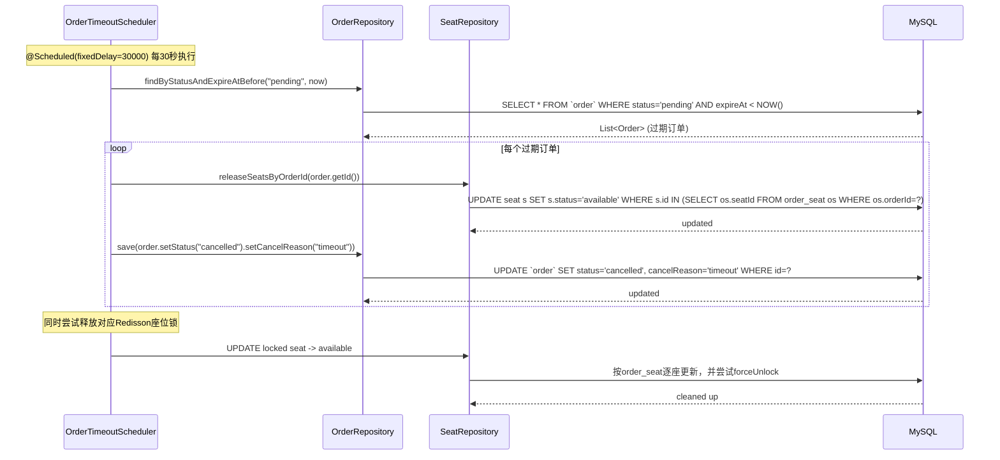

# 电影票智能体 — 后端系统分析文档

> 版本：V1.2 | 日期：2026-07-30 | 作者：李振南、陆博、王静兰、王睿洋

---

## 变更记录

| 版本 | 修订日期 | 修订人 | 修订内容 |
|------|----------|--------|----------|
| V1.0 | 2026-07-29 | 李振南、陆博、王静兰、王睿洋 | 基于PRD合并版V1.1完成AI后端+票务中台+DB+C端API+B端API系分设计，合并整理 |
| V1.1 | 2026-07-29 | 李振南 | 参考系分模板完善：增加项目背景、流程图、UML类图、详细时序图、关键技术设计、排期、附录 |
| V1.2 | 2026-07-30 | Codex辅助核验 | 在原系分结构上对照当前仓库实现：补充实现基线与接口清单，修正技术栈、Agent编排、Redis会话、数据库表数、调度周期、支付和鉴权说明；保留未落地内容并标注为目标设计 |

> **阅读约定：** 本文同时保留“目标设计”和“当前实现”。带有“目标设计”标记的状态机、卡片协议、规划接口和目录结构用于后续演进，不代表仓库当前已存在；事实验收以对应模块的实现说明、实际源码、`application.yml`、`sql/create_sql.sql` 为准。

---

## 项目背景

电影票智能体是一个基于AI对话的在线选座购票系统。当前公司缺乏统一的在线选座购票平台，用户需要通过第三方平台购票，无法通过自然语言快速完成观影需求的表达和满足。本系统旨在：

1. **对话式购票体验**：用户通过自然语言表达观影需求（如"两张明天下午离公司最近的IMAX流浪地球3"），AI Agent 自动完成选片→选影院→选场次→选座→下单→支付全流程
2. **智能推荐与跳步**：当用户一次性提供足够信息时，Agent自动跳过中间步骤直达选座或下单，提升效率
3. **座位库存并发控制**：确保高并发场景下座位不超卖
4. **后台内容管理**：为运营人员提供影片、影院、场次的内容管理和数据看板

---

## 相关资料

- [电影票智能体-PRD.md](../电影票智能体-PRD.md) — 产品规格说明书
- [前端系分文档.md](前端系分.md) — 前端系统分析文档
- [API接口规范.md]() — 前后端接口约定
- [create_sql.sql](../sql/create_sql.sql) — 当前数据库建表脚本
- [Spring Boot 3 文档](https://docs.spring.io/spring-boot/docs/3.x/reference/html/) — 后端框架文档
- [支付宝沙箱文档](https://opendocs.alipay.com/open/200/105311) — 支付对接
- [MCP协议规范](https://modelcontextprotocol.io/) — MCP协议参考

---

## 参与人

| 角色 | 姓名 |
|------|------|
| 项目负责人 | — |
| 产品经理 | — |
| AI Agent引擎开发 | 李振南 |
| 票务中台开发 | 陆博 |
| C端后端API开发 | 王静兰 |
| B端后端API开发 | 王睿洋 |

---

## 功能模块

本模块核心功能包括：

1. **AI Agent引擎**：GuardRail输入防护、ReAct工具自主编排、RAG知识库检索、提示词管理、Redis上下文记忆；固定状态机、独立NLP分类器为目标设计
2. **票务业务中台**：座位库存管理（★SELECT FOR UPDATE并发控制）、订单生成与管理、支付宝沙箱支付模拟、超时定时任务（15分钟自动释放）、用户偏好存取
3. **C端后端API**：电影Agent对话（`/api/movie-agent/chat`、`/api/movie-agent/chat-stream`）、Redis会话状态、聊天历史、用户偏好、订单查询
4. **B端后端API**：管理员鉴权、影片/影院/场次CRUD、排片冲突校验、批量排片、数据看板聚合查询、推荐策略配置、系统参数配置、对话模板管理、用户/订单管理
5. **数据库**：12张表设计（新增 `chat_session`，其余为user/user_preference/film/cinema/hall/schedule/seat/order/order_seat/chat_history/system_config）、预置影院数据、索引优化

---

## 功能模块树

```
电影票智能体后端
├── AI Agent引擎 (李振南)
│   ├── Agent编排
│   │   ├── ReAct自主编排（固定状态机为目标设计）
│   │   ├── 任务规划器
│   │   │   ├── 意图识别（10分类）
│   │   │   ├── 槽位提取
│   │   │   ├── 槽位合并（新旧合并）
│   │   │   ├── 槽位完备度检查（递归跳步核心）
│   │   │   └── 自动跳步决策
│   │   └── 追问生成器（单次一个维度）
│   ├── 工具调用（Function Calling）
│   │   ├── 工具注册与调度（MovieToolManager + ToolCallback）
│   │   ├── 8个业务工具定义
│   │   │   ├── searchFilms（影片搜索）
│   │   │   ├── searchCinemas（影院筛选）
│   │   │   ├── searchSchedules（场次查询）
│   │   │   ├── getSeatMap（座位图获取）
│   │   │   ├── lockSeats（座位锁定★）
│   │   │   ├── createOrder（订单生成）
│   │   │   ├── payOrder（支付模拟）
│   │   │   └── getUserPreference（用户偏好）
│   │   └── 异常处理（冲突/售罄备选方案）
│   ├── RAG知识库
│   │   ├── 影片知识库
│   │   ├── 影院知识库
│   │   ├── FAQ对话知识库
│   │   └── 推荐策略库
│   ├── 提示词设计
│   │   ├── System Prompt
│   │   ├── 意图识别Prompt
│   │   ├── 槽位提取Prompt
│   │   ├── 追问模板
│   │   ├── 异常推荐模板
│   │   └── 情感化模板
│   ├── 上下文记忆
│   │   ├── 会话状态缓存（Redis，30分钟TTL）
│   │   ├── 用户偏好（user_preference表）
│   │   └── 指代消解
│   └── MCP接入
│       ├── Spring AI MCP Client
│       ├── mcp-servers.json服务配置
│       └── MCP ToolCallback合并
├── 票务业务中台 (陆博)
│   ├── 座位库存服务（★核心）
│   │   ├── 锁座（SELECT FOR UPDATE行锁）
│   │   ├── 释放座位
│   │   ├── 售罄检测
│   │   └── 相邻座位推荐
│   ├── 订单服务
│   │   ├── 订单创建（冗余字段快照）
│   │   ├── 支付宝回调处理
│   │   └── 订单状态流转
│   ├── 支付服务
│   │   ├── 支付宝沙箱电脑网站支付（Page Pay）
│   │   ├── HTML支付表单生成
│   │   └── 异步通知RSA验签
│   ├── 超时调度
│   │   ├── 每30秒扫描过期订单
│   │   ├── 自动释放锁定座位
│   │   └── 双保险清理（主动+定时）
│   ├── 用户偏好服务
│   │   ├── 偏好存储/读取
│   │   └── 购后增量更新
│   └── Mock数据初始化
│       ├── 5部影片
│       ├── 3个影院 + 6个影厅
│       ├── 场次自动生成
│       ├── 座位自动初始化
│       └── 3套用户画像
├── C端后端API (王静兰)
│   ├── 对话接口
│   │   ├── POST /api/movie-agent/chat（非流式对话）
│   │   ├── GET /api/movie-agent/chat-stream（SSE对话）
│   │   └── GET /api/chatHistory/listBySession/{sessionId}（历史）
│   ├── 会话管理（Redis，30min过期）
│   ├── 卡片数据组装
│   └── 用户偏好/订单接口
└── B端后端API (王睿洋)
    ├── 鉴权（HttpSession + Redis + @AuthCheck）
    ├── 影片管理 CRUD
    ├── 影院管理 CRUD + 影厅子资源
    ├── 场次管理 CRUD + 冲突校验 + 批量排片
    ├── 数据看板聚合查询
    ├── 配置管理（策略/系统/对话模板）
    └── 用户/订单管理
```

# 第一篇：系统总览

## 1. 系统架构总览

电影票智能体后端采用三层架构，层间通过标准化 API 通信：

```
┌─────────────────────────────────────────────────────────────┐
│                 用户交互层 (前端)                            │
│    C端前端 (H5对话购票) [王静兰] + B端前端 (后台管理) [王睿洋]│
└─────────────────────────────────────────────────────────────┘
                           ↕ HTTP REST
┌─────────────────────────────────────────────────────────────┐
│               ★ 后端系统（本系分文档范围）                    │
│                                                             │
│  ┌─────────────────────────────────────────────────────┐    │
│  │  C端后端API (王静兰)                                 │    │
│  │  /api/movie-agent/*, /api/user/*, /api/order/*      │    │
│  └──────────────────────────┬──────────────────────────┘    │
│                             ↓                                │
│  ┌─────────────────────────────────────────────────────┐    │
│  │  AI Agent 引擎 (李振南)                              │    │
│  │  GuardRail | ReAct自主编排 | Redis记忆管理          │    │
│  │  RAG文档 | 提示词设计 | MCP Client | ToolCallback   │    │
│  └──────────────────────────┬──────────────────────────┘    │
│                             ↓                                │
│  ┌─────────────────────────────────────────────────────┐    │
│  │  票务业务中台 (陆博)                                 │    │
│  │  座位库存(★并发) | 订单服务 | 支付模拟 | 超时调度    │    │
│  └──────────────────────────┬──────────────────────────┘    │
│                             ↓                                │
│  ┌─────────────────────────────────────────────────────┐    │
│  │  数据库 MySQL (陆博)                                 │    │
│  │  12张表：user/chat_session/chat_history/             │    │
│  │  user_preference/film/cinema/hall/schedule/seat/     │    │
│  │  order/order_seat/system_config                       │    │
│  └─────────────────────────────────────────────────────┘    │
│                                                             │
│  ┌─────────────────────────────────────────────────────┐    │
│  │  B端后端API (王睿洋)                                 │    │
│  │  /api/film, /api/cinema, /api/schedule,              │    │
│  │  /api/order/admin/*, /api/dashboard/stats            │    │
│  └─────────────────────────────────────────────────────┘    │
└─────────────────────────────────────────────────────────────┘
```

### 1.1 后端模块职责矩阵

| 模块 | 负责范围 | 核心输出 |
|------|---------|---------|
| **AI Agent引擎** | GuardRail、ReAct编排、工具调用、RAG文档、提示词、MCP Client | 8个本地工具、MCP工具、System Prompt、Redis状态 |
| **票务业务中台** | 数据库设计(12表)、座位库存(★并发控制)、订单、支付、超时调度 | DDL、SeatService、OrderService、30秒定时任务 |
| **C端后端API** | 电影对话、Redis会话状态、聊天历史、偏好和订单 | MovieAgentController、ChatHistoryController、OrderController |
| **B端后端API** | 鉴权、影片/影院/场次CRUD、数据看板、配置管理、用户/订单管理 | 6组Controller、全局异常处理 |

### 1.2 技术栈

| 分类 | 选型 |
|------|------|
| 语言 | Java 21 |
| 框架 | Spring Boot 3.5.5 |
| AI框架 | Spring AI 1.1.2 + Spring AI Alibaba 1.1.2.0 |
| ORM | MyBatis-Flex 1.11.0 |
| 数据库 | MySQL + HikariCP |
| 缓存/会话 | Redis + Redisson + Spring Session Data Redis |
| 调度 | Spring @Scheduled |
| 支付 | 支付宝电脑网站支付（Page Pay） |
| MCP | Spring AI MCP Client |

### 1.3 当前运行形态

当前应用为单体 Spring Boot 服务，根包为 `com.limou.agent`，默认端口为 `8123`，上下文路径为 `/api`。Controller、Service、Mapper、Entity 分层组织，MySQL 通过 MyBatis-Flex 访问；Redis 同时承载 HttpSession、电影Agent状态、模型记忆、限流和分布式锁。文件上传使用腾讯云 COS，地理位置接口调用高德服务，接口文档使用 Knife4j。

---

## 2. 核心流程图

### 2.1 完整购票流程（后端视角）

```
C端前端 POST /api/movie-agent/chat
    │
    ▼
┌─────────────────────────┐
│ MovieAgentController    │
│ - 接收JSON消息           │
│ - 传递conversationId     │
│ - 路由到 AiService       │
└────────────┬────────────┘
             │
             ▼
┌─────────────────────────┐
│ MovieAgentWorkflow      │
│ - GuardRail输入检查      │
│ - 放行或返回拦截提示      │
│ - 交给ReAct Agent         │
└────────────┬────────────┘
             │
    ┌────────┴────────┐
    │
    ▼
┌─────────────────────────┐
│ ReAct ToolCallback      │
│ - 模型自主决定调用顺序   │
│ - searchFilms /         │
│   searchCinemas /       │
│   searchSchedules /     │
│   getSeatMap /          │
│   lockSeats ★ /         │
│   createOrder /         │
│   payOrder /            │
│   getUserPreference      │
└────────────┬────────────┘
             │
             ▼
┌─────────────────────────┐
│ 中台 Service层          │
│ - SeatService（行锁）    │
│ - OrderService          │
│ - PaymentService        │
└────────────┬────────────┘
             │
             ▼
┌─────────────────────────┐
│ MySQL 数据库             │
│ - 读/写操作              │
│ - 事务管理               │
└────────────┬────────────┘
             │
             ▼
┌─────────────────────────┐
│ 响应输出                │
│ - 普通接口返回字符串     │
│ - SSE文本块和tool_start  │
│ - done事件               │
└─────────────────────────┘
```

### 2.2 座位锁定并发控制流程

```
并发用户A/B同时请求锁定相同座位
    │
    ▼
┌────────────────────────────────────┐
│ @Transactional                     │
│ isolation = REPEATABLE_READ        │
│                                    │
│ 1. SELECT ... FOR UPDATE (行锁)    │
│    → 用户A先获得锁，用户B等待       │
│    └── 查询目标座位当前状态         │
│                                    │
│ 2. 状态检查                        │
│    status = 'available' ?          │
│    ├── YES: 继续                   │
│    └── NO: 返回冲突 → 推荐相邻座位   │
│                                    │
│ 3. UPDATE status = 'locked'        │
│    (批量原子更新)                   │
│                                    │
│ 4. 售罄检查                        │
│    remaining == 0 ?                │
│    └── 更新场次 status = 'soldOut' │
│                                    │
│ 5. COMMIT (释放行锁)               │
│    → 用户B获得锁，但状态已是locked  │
│    → 用户B返回冲突                 │
└────────────────────────────────────┘
```

### 2.3 支付宝支付回调流程

```
用户扫码支付
    │
    ▼
┌─────────────────────────┐
│ 支付宝异步通知            │
│ POST /api/alipay/notify │
│ (需验签)                 │
└────────────┬────────────┘
             │
             ▼
┌─────────────────────────┐
│ 验签通过                │
└────────────┬────────────┘
             │
    ┌────────┴────────────┐
    │                     │
TRADE_SUCCESS        TRADE_CLOSED
    │                     │
    ▼                     ▼
┌──────────────┐   ┌──────────────┐
│ 订单→paid    │   │ 订单→cancelled│
│ 座位→sold    │   │ 座位→available│
│ 更新用户偏好  │   │              │
│ paidAt=now   │   │ cancelReason=│
│              │   │ payment_     │
│              │   │ timeout      │
└──────────────┘   └──────────────┘
```

---

## 3. UML 类图

### 3.1 核心领域模型

```mermaid
classDiagram
class User {
  -Long id
  -String userAccount
  -String userPassword
  -String userName
  -String userRole
  -Boolean isDelete
  -DateTime createTime
  -DateTime updateTime
}

class UserPreference {
  -Long id
  -Long userId
  -String preferredTypes
  -String preferredHallType
  -BigDecimal budgetMax
  -Long frequentCinemaId
  -String preferredSeatZone
  -Boolean isDelete
}

class Film {
  -Long id
  -String name
  -String englishName
  -String type
  -BigDecimal rating
  -Integer duration
  -String posterUrl
  -Date releaseDate
  -String director
  -String actors
  -String description
  -String status
}

class Cinema {
  -Long id
  -String name
  -String address
  -BigDecimal longitude
  -BigDecimal latitude
  -String phone
  -String businessHours
  -String tags
  -BigDecimal basePrice
  -String status
}

class Hall {
  -Long id
  -Long cinemaId
  -String name
  -String hallType
  -Integer rowCount
  -Integer colCount
  -JSON seatTemplate
}

class Schedule {
  -Long id
  -Long filmId
  -Long cinemaId
  -Long hallId
  -Date showDate
  -Time startTime
  -Time endTime
  -BigDecimal price
  -BigDecimal vipPrice
  -String status
}

class Seat {
  -Long id
  -Long scheduleId
  -Long hallId
  -Integer rowNum
  -Integer colNum
  -String seatLabel
  -String zone
  -String status
}

class Order {
  -Long id
  -String orderNo
  -Long userId
  -Long scheduleId
  -String filmName
  -String cinemaName
  -String scheduleTime
  -String hallName
  -BigDecimal totalPrice
  -Integer count
  -String status
  -String cancelReason
  -String alipayTradeNo
  -DateTime paidAt
  -DateTime expireAt
}

class OrderSeat {
  -Long id
  -Long orderId
  -Long seatId
  -String seatLabel
  -Boolean isUsed
}

class ChatHistory {
  -Long id
  -String sessionId
  -Long userId
  -String message
  -String messageType
  -JSON metadata
}

class SystemConfig {
  -Long id
  -String configKey
  -JSON configValue
  -String description
}

User "1" -- "1" UserPreference : has
User "1" -- "N" Order : places
User "1" -- "N" ChatHistory : has
Order "1" -- "N" OrderSeat : contains
OrderSeat "N" -- "1" Seat : references
Seat "N" -- "1" Schedule : belongs to
Seat "N" -- "1" Hall : snapshot of
Schedule "N" -- "1" Film : schedules
Schedule "N" -- "1" Cinema : at
Schedule "N" -- "1" Hall : uses
Hall "N" -- "1" Cinema : belongs to
```

---

# 第二篇：数据库设计

## 4. 数据库总体设计

当前 `sql/create_sql.sql` 定义 12 张表：`user`、`chat_session`、`chat_history`、`user_preference`、`film`、`cinema`、`hall`、`schedule`、`seat`、`order`、`order_seat`、`system_config`。原方案中的11表统计遗漏了 `chat_session`。DDL统一使用InnoDB和utf8mb4，主要表采用 `isDelete` 逻辑删除及 `createTime`/`updateTime` 审计字段，不声明外键，由Service维护关联完整性。

- **数据库名**: `AI_Code`
- **引擎**: InnoDB
- **字符集**: utf8mb4
- **命名规范**: 表名snake_case，字段camelCase
- **主键**: BIGINT AUTO_INCREMENT
- **逻辑删除**: 所有表含 `isDelete` 字段
- **不使用外键**: 通过逻辑关联保证灵活性

### 4.1 ER图

```
┌──────────┐   1:1   ┌─────────────────┐
│   user   │────────→│ user_preference │
│ (用户)   │         │   (用户偏好画像)  │
└────┬─────┘         └─────────────────┘
     │ 1:N
     ↓
┌──────────┐
│  order   │───→ order_seat (订单-座位关联)
│ (订单)   │
└────┬─────┘
     │ N:1
     ↓
┌──────────┐   N:1   ┌──────────┐   N:1   ┌──────────┐
│ schedule │←────────│   film   │         │  cinema  │
│ (场次)   │         │  (影片)  │         │  (影院)  │
└────┬─────┘         └──────────┘         └────┬─────┘
     │ N:1                                    │ 1:N
     ↓                                        ↓
┌──────────┐                              ┌──────────┐
│   seat   │                              │   hall   │
│ (座位)   │                              │  (影厅)  │
└──────────┘                              └──────────┘

┌──────────────┐     ┌──────────────┐
│ chat_history │     │system_config │
│ (对话历史)   │     │ (系统配置)   │
└──────────────┘     └──────────────┘
```

### 4.2 核心表DDL

#### user — 用户账号

```sql
CREATE TABLE `user` (
    `id`           BIGINT       NOT NULL AUTO_INCREMENT COMMENT '主键ID',
    `userAccount`  VARCHAR(50)  NOT NULL COMMENT '用户登录账号',
    `userPassword` VARCHAR(255) NOT NULL COMMENT '登录密码（当前为固定盐MD5摘要，需升级）',
    `userName`     VARCHAR(50)  NOT NULL COMMENT '用户昵称/姓名',
    `userRole`     VARCHAR(20)  NOT NULL DEFAULT 'user' COMMENT '角色: user/admin',
    `isDelete`     TINYINT(1)   NOT NULL DEFAULT 0 COMMENT '逻辑删除',
    `createTime`   DATETIME     NOT NULL DEFAULT CURRENT_TIMESTAMP,
    `updateTime`   DATETIME     NOT NULL DEFAULT CURRENT_TIMESTAMP ON UPDATE CURRENT_TIMESTAMP,
    PRIMARY KEY (`id`),
    UNIQUE KEY `uk_userAccount` (`userAccount`),
    KEY `idx_userRole` (`userRole`)
) ENGINE=InnoDB DEFAULT CHARSET=utf8mb4 COMMENT='用户账号';
```

#### user_preference — 用户偏好画像 (1:1 with user)

```sql
CREATE TABLE `user_preference` (
    `id`                BIGINT       NOT NULL AUTO_INCREMENT COMMENT '主键ID',
    `userId`            BIGINT       NOT NULL COMMENT '用户ID',
    `preferredTypes`    VARCHAR(255) DEFAULT NULL COMMENT '偏好影片类型，逗号分隔',
    `preferredHallType` VARCHAR(50)  DEFAULT NULL COMMENT '偏好厅型: IMAX/杜比/普通/4DX/VIP',
    `budgetMax`         DECIMAL(10,2) DEFAULT NULL COMMENT '单张票价预算上限（元）',
    `frequentCinemaId`  BIGINT       DEFAULT NULL COMMENT '常去影院ID',
    `preferredSeatZone` VARCHAR(50)  DEFAULT NULL COMMENT '常用座位区域: 中间/靠前/靠后/靠边',
    `isDelete`          TINYINT(1)   NOT NULL DEFAULT 0,
    `createTime`        DATETIME     NOT NULL DEFAULT CURRENT_TIMESTAMP,
    `updateTime`        DATETIME     NOT NULL DEFAULT CURRENT_TIMESTAMP ON UPDATE CURRENT_TIMESTAMP,
    PRIMARY KEY (`id`),
    UNIQUE KEY `uk_userId` (`userId`),
    KEY `idx_frequentCinema` (`frequentCinemaId`)
) ENGINE=InnoDB DEFAULT CHARSET=utf8mb4 COMMENT='用户偏好画像';
```

#### film — 影片

```sql
CREATE TABLE `film` (
    `id`          BIGINT       NOT NULL AUTO_INCREMENT COMMENT '主键ID',
    `name`        VARCHAR(100) NOT NULL COMMENT '影片名称',
    `englishName` VARCHAR(100) DEFAULT NULL COMMENT '英文名称',
    `type`        VARCHAR(100) DEFAULT NULL COMMENT '影片类型，逗号分隔',
    `rating`      DECIMAL(3,1) DEFAULT NULL COMMENT '评分 1.0-10.0',
    `duration`    INT          NOT NULL COMMENT '片长（分钟）',
    `posterUrl`   VARCHAR(500) DEFAULT NULL COMMENT '海报图片地址',
    `releaseDate` DATE         DEFAULT NULL COMMENT '上映日期',
    `director`    VARCHAR(100) DEFAULT NULL COMMENT '导演',
    `actors`      VARCHAR(500) DEFAULT NULL COMMENT '主演，逗号分隔',
    `description` TEXT         DEFAULT NULL COMMENT '影片简介（最多500字）',
    `status`      VARCHAR(20)  NOT NULL DEFAULT 'draft' COMMENT '状态: draft/published/offline',
    `isDelete`    TINYINT(1)   NOT NULL DEFAULT 0,
    `createTime`  DATETIME     NOT NULL DEFAULT CURRENT_TIMESTAMP,
    `updateTime`  DATETIME     NOT NULL DEFAULT CURRENT_TIMESTAMP ON UPDATE CURRENT_TIMESTAMP,
    PRIMARY KEY (`id`),
    KEY `idx_status` (`status`),
    KEY `idx_rating` (`rating`),
    KEY `idx_releaseDate` (`releaseDate`)
) ENGINE=InnoDB DEFAULT CHARSET=utf8mb4 COMMENT='影片';
```

#### cinema — 影院

```sql
CREATE TABLE `cinema` (
    `id`            BIGINT       NOT NULL AUTO_INCREMENT COMMENT '主键ID',
    `name`          VARCHAR(100) NOT NULL COMMENT '影院名称',
    `address`       VARCHAR(255) DEFAULT NULL COMMENT '详细地址',
    `longitude`     DECIMAL(10,6) DEFAULT NULL COMMENT '经度（高德坐标系）',
    `latitude`      DECIMAL(10,6) DEFAULT NULL COMMENT '纬度（高德坐标系）',
    `phone`         VARCHAR(20)  DEFAULT NULL COMMENT '联系电话',
    `businessHours` VARCHAR(50)  DEFAULT NULL COMMENT '营业时间: 09:00-23:00',
    `tags`          VARCHAR(255) DEFAULT NULL COMMENT '特色标签，逗号分隔',
    `basePrice`     DECIMAL(10,2) DEFAULT NULL COMMENT '基准票价（元）',
    `status`        VARCHAR(20)  NOT NULL DEFAULT 'draft' COMMENT '状态: draft/published/offline',
    `isDelete`      TINYINT(1)   NOT NULL DEFAULT 0,
    `createTime`    DATETIME     NOT NULL DEFAULT CURRENT_TIMESTAMP,
    `updateTime`    DATETIME     NOT NULL DEFAULT CURRENT_TIMESTAMP ON UPDATE CURRENT_TIMESTAMP,
    PRIMARY KEY (`id`),
    KEY `idx_status` (`status`),
    KEY `idx_location` (`longitude`, `latitude`)
) ENGINE=InnoDB DEFAULT CHARSET=utf8mb4 COMMENT='影院';
```

#### hall — 影厅（含座位模板）

```sql
CREATE TABLE `hall` (
    `id`           BIGINT      NOT NULL AUTO_INCREMENT COMMENT '主键ID',
    `cinemaId`     BIGINT      NOT NULL COMMENT '所属影院ID',
    `name`         VARCHAR(50) NOT NULL COMMENT '影厅名称',
    `hallType`     VARCHAR(50) NOT NULL DEFAULT '普通' COMMENT '厅型: IMAX/杜比/普通/4DX/VIP',
    `rowCount`     INT         NOT NULL COMMENT '座位行数',
    `colCount`     INT         NOT NULL COMMENT '座位列数',
    `seatTemplate` JSON        DEFAULT NULL COMMENT '座位模板JSON（特殊座位标记等）',
    `isDelete`     TINYINT(1)  NOT NULL DEFAULT 0,
    `createTime`   DATETIME    NOT NULL DEFAULT CURRENT_TIMESTAMP,
    `updateTime`   DATETIME    NOT NULL DEFAULT CURRENT_TIMESTAMP ON UPDATE CURRENT_TIMESTAMP,
    PRIMARY KEY (`id`),
    KEY `idx_cinemaId` (`cinemaId`),
    KEY `idx_hallType` (`hallType`)
) ENGINE=InnoDB DEFAULT CHARSET=utf8mb4 COMMENT='影厅';
```

#### schedule — 放映场次

```sql
CREATE TABLE `schedule` (
    `id`         BIGINT       NOT NULL AUTO_INCREMENT COMMENT '主键ID',
    `filmId`     BIGINT       NOT NULL COMMENT '影片ID',
    `cinemaId`   BIGINT       NOT NULL COMMENT '影院ID',
    `hallId`     BIGINT       NOT NULL COMMENT '影厅ID',
    `showDate`   DATE         NOT NULL COMMENT '放映日期',
    `startTime`  TIME         NOT NULL COMMENT '开场时间',
    `endTime`    TIME         NOT NULL COMMENT '散场时间（自动计算: startTime + 片长 + 15min）',
    `price`      DECIMAL(10,2) NOT NULL COMMENT '标准票价（元）',
    `vipPrice`   DECIMAL(10,2) DEFAULT NULL COMMENT 'VIP区票价（元）',
    `status`     VARCHAR(20)  NOT NULL DEFAULT 'draft' COMMENT '状态: draft/published/offline/soldOut',
    `isDelete`   TINYINT(1)   NOT NULL DEFAULT 0,
    `createTime` DATETIME     NOT NULL DEFAULT CURRENT_TIMESTAMP,
    `updateTime` DATETIME     NOT NULL DEFAULT CURRENT_TIMESTAMP ON UPDATE CURRENT_TIMESTAMP,
    PRIMARY KEY (`id`),
    KEY `idx_filmId` (`filmId`),
    KEY `idx_cinemaId` (`cinemaId`),
    KEY `idx_hallId` (`hallId`),
    KEY `idx_showDate` (`showDate`),
    KEY `idx_film_date` (`filmId`, `showDate`),
    KEY `idx_cinema_date` (`cinemaId`, `showDate`),
    KEY `idx_status` (`status`)
) ENGINE=InnoDB DEFAULT CHARSET=utf8mb4 COMMENT='放映场次';
```

#### seat — 座位（场次快照）★核心

```sql
CREATE TABLE `seat` (
    `id`         BIGINT      NOT NULL AUTO_INCREMENT COMMENT '主键ID',
    `scheduleId` BIGINT      NOT NULL COMMENT '场次ID',
    `hallId`     BIGINT      NOT NULL COMMENT '影厅ID',
    `rowNum`     INT         NOT NULL COMMENT '行号（从1开始）',
    `colNum`     INT         NOT NULL COMMENT '列号（从1开始）',
    `seatLabel`  VARCHAR(10) NOT NULL COMMENT '座位标签: 5排6座',
    `zone`       VARCHAR(20) NOT NULL DEFAULT 'regular' COMMENT '区域: vip/regular',
    `status`     VARCHAR(20) NOT NULL DEFAULT 'available' COMMENT '状态: available/locked/sold',
    `isDelete`   TINYINT(1)  NOT NULL DEFAULT 0,
    `createTime` DATETIME    NOT NULL DEFAULT CURRENT_TIMESTAMP,
    `updateTime` DATETIME    NOT NULL DEFAULT CURRENT_TIMESTAMP ON UPDATE CURRENT_TIMESTAMP,
    PRIMARY KEY (`id`),
    KEY `idx_scheduleId` (`scheduleId`),
    KEY `idx_hallId` (`hallId`),
    KEY `idx_schedule_zone` (`scheduleId`, `zone`),
    KEY `idx_schedule_status` (`scheduleId`, `status`),
    UNIQUE KEY `uk_schedule_seat` (`scheduleId`, `rowNum`, `colNum`)
) ENGINE=InnoDB DEFAULT CHARSET=utf8mb4 COMMENT='座位（场次快照）';
```

> **设计要点**: 座位是场次的"快照"，创建场次时根据影厅seatTemplate自动初始化seat记录。`uk_schedule_seat` 唯一约束防止同一座位重复创建。`idx_schedule_status` 联合索引优化锁座查询。

#### order — 订单

```sql
CREATE TABLE `order` (
    `id`            BIGINT       NOT NULL AUTO_INCREMENT COMMENT '主键ID',
    `orderNo`       VARCHAR(64)  NOT NULL COMMENT '订单编号（唯一）',
    `userId`        BIGINT       NOT NULL COMMENT '用户ID',
    `scheduleId`    BIGINT       NOT NULL COMMENT '场次ID',
    `filmName`      VARCHAR(100) DEFAULT NULL COMMENT '影片名称（冗余）',
    `cinemaName`    VARCHAR(100) DEFAULT NULL COMMENT '影院名称（冗余）',
    `scheduleTime`  VARCHAR(50)  DEFAULT NULL COMMENT '放映时间（冗余）',
    `hallName`      VARCHAR(50)  DEFAULT NULL COMMENT '影厅名称（冗余）',
    `totalPrice`    DECIMAL(10,2) NOT NULL COMMENT '订单总价（元）',
    `count`         INT          NOT NULL COMMENT '购票数量',
    `status`        VARCHAR(20)  NOT NULL DEFAULT 'pending' COMMENT '状态: pending/paid/cancelled/completed',
    `cancelReason`  VARCHAR(50)  DEFAULT NULL COMMENT '取消原因: timeout/user_cancelled',
    `alipayTradeNo` VARCHAR(100) DEFAULT NULL COMMENT '支付宝交易号（沙箱生成）',
    `alipayStatus`  VARCHAR(50)  DEFAULT NULL COMMENT '支付宝状态',
    `paidAt`        DATETIME     DEFAULT NULL COMMENT '实际支付时间',
    `expireAt`      DATETIME     DEFAULT NULL COMMENT '超时截止时间（创建时间+15分钟）',
    `isDelete`      TINYINT(1)   NOT NULL DEFAULT 0,
    `createTime`    DATETIME     NOT NULL DEFAULT CURRENT_TIMESTAMP,
    `updateTime`    DATETIME     NOT NULL DEFAULT CURRENT_TIMESTAMP ON UPDATE CURRENT_TIMESTAMP,
    PRIMARY KEY (`id`),
    UNIQUE KEY `uk_orderNo` (`orderNo`),
    KEY `idx_userId` (`userId`),
    KEY `idx_scheduleId` (`scheduleId`),
    KEY `idx_status` (`status`),
    KEY `idx_expireAt` (`expireAt`),
    KEY `idx_user_status` (`userId`, `status`),
    KEY `idx_alipayTradeNo` (`alipayTradeNo`)
) ENGINE=InnoDB DEFAULT CHARSET=utf8mb4 COMMENT='订单';
```

#### order_seat — 订单-座位关联（电子票）

```sql
CREATE TABLE `order_seat` (
    `id`         BIGINT      NOT NULL AUTO_INCREMENT COMMENT '主键ID',
    `orderId`    BIGINT      NOT NULL COMMENT '订单ID',
    `seatId`     BIGINT      NOT NULL COMMENT '座位ID',
    `seatLabel`  VARCHAR(10) NOT NULL COMMENT '座位标签（冗余: 5排6座）',
    `isUsed`     TINYINT(1)  NOT NULL DEFAULT 0 COMMENT '是否已使用: 0-未使用 1-已核销',
    `isDelete`   TINYINT(1)  NOT NULL DEFAULT 0,
    `createTime` DATETIME    NOT NULL DEFAULT CURRENT_TIMESTAMP,
    `updateTime` DATETIME    NOT NULL DEFAULT CURRENT_TIMESTAMP ON UPDATE CURRENT_TIMESTAMP,
    PRIMARY KEY (`id`),
    KEY `idx_orderId` (`orderId`),
    KEY `idx_seatId` (`seatId`),
    KEY `idx_order_seat` (`orderId`, `seatId`)
) ENGINE=InnoDB DEFAULT CHARSET=utf8mb4 COMMENT='订单-座位关联（电子票）';
```

#### chat_history — 对话历史记录

```sql
CREATE TABLE `chat_history` (
    `id`          BIGINT      NOT NULL AUTO_INCREMENT COMMENT '主键ID',
    `sessionId`   VARCHAR(64) NOT NULL COMMENT '会话ID（对应Redis session）',
    `userId`      BIGINT      DEFAULT NULL COMMENT '用户ID（未登录可为空）',
    `message`     TEXT        NOT NULL COMMENT '消息内容',
    `messageType` VARCHAR(10) NOT NULL COMMENT '消息类型: user/ai',
    `metadata`    JSON        DEFAULT NULL COMMENT '附加元数据（卡片类型、槽位快照等）',
    `isDelete`    TINYINT(1)  NOT NULL DEFAULT 0,
    `createTime`  DATETIME    NOT NULL DEFAULT CURRENT_TIMESTAMP,
    PRIMARY KEY (`id`),
    KEY `idx_sessionId` (`sessionId`),
    KEY `idx_userId` (`userId`),
    KEY `idx_session_create` (`sessionId`, `createTime`)
) ENGINE=InnoDB DEFAULT CHARSET=utf8mb4 COMMENT='对话历史记录';
```

#### system_config — 系统配置

```sql
CREATE TABLE `system_config` (
    `id`          BIGINT       NOT NULL AUTO_INCREMENT COMMENT '主键ID',
    `configKey`   VARCHAR(100) NOT NULL COMMENT '配置键',
    `configValue` JSON         NOT NULL COMMENT '配置值（JSON格式）',
    `description` VARCHAR(255) DEFAULT NULL COMMENT '配置说明',
    `isDelete`    TINYINT(1)   NOT NULL DEFAULT 0,
    `createTime`  DATETIME     NOT NULL DEFAULT CURRENT_TIMESTAMP,
    `updateTime`  DATETIME     NOT NULL DEFAULT CURRENT_TIMESTAMP ON UPDATE CURRENT_TIMESTAMP,
    PRIMARY KEY (`id`),
    UNIQUE KEY `uk_configKey` (`configKey`)
) ENGINE=InnoDB DEFAULT CHARSET=utf8mb4 COMMENT='系统配置';
```

### 4.3 索引设计说明

| 表 | 索引名 | 索引字段 | 用途 |
|----|--------|---------|------|
| user | uk_userAccount | userAccount | 登录查询（唯一索引） |
| user | idx_userRole | userRole | 按角色查询用户 |
| user_preference | uk_userId | userId | 1:1关联查询（唯一索引） |
| film | idx_status | status | 已发布影片筛选 |
| film | idx_rating | rating | 评分排序 |
| cinema | idx_location | (longitude, latitude) | 距离计算筛选 |
| hall | idx_cinemaId | cinemaId | 影院下影厅列表 |
| schedule | idx_film_date | (filmId, showDate) | 某影片某天场次 |
| schedule | idx_cinema_date | (cinemaId, showDate) | 某影院某天场次 |
| seat | uk_schedule_seat | (scheduleId, rowNum, colNum) | 防重+快速定位（唯一索引） |
| seat | idx_schedule_status | (scheduleId, status) | 锁座状态筛选 |
| order | uk_orderNo | orderNo | 订单号唯一查询 |
| order | idx_expireAt | expireAt | 超时扫描 |
| order | idx_user_status | (userId, status) | 用户订单列表 |
| chat_history | idx_session_create | (sessionId, createTime) | 会话历史按时间查询 |

---

# 第三篇：时序图

## 5. 查询组织架构树时序（类比：C端对话购票完整时序）

### 5.1 用户输入→Agent→中台→数据库全链路时序

> **实现校准：** 下表原有ChatController、ChatService、AgentOrchestrator、ToolRegistry和Caffeine为目标设计。当前实际调用链为 `MovieAgentController → AiServiceImpl → MovieAgentWorkflow(GuardRail) → AiCodeGeneratorFactory(ReAct) → MovieToolManager(ToolCallback)`，状态写Redis，历史写`chat_history`。


**交互说明：**

| 步骤 | 参与者 | 动作 |
|------|--------|------|
| 1 | MovieAgentController | 接收POST或SSE请求 |
| 2 | AiServiceImpl | 调用MovieAgentWorkflow进行输入检查 |
| 3 | MovieAgentWorkflow | GuardRail通过后放行 |
| 4 | AiCodeGeneratorFactory | 创建/复用ReAct Agent并注入系统提示词 |
| 5 | MovieToolManager | 注册本地ToolCallback并合并MCP工具 |
| 6 | ToolCallback | 模型自主调用影片、影院、场次、座位工具 |
| 7 | OrderService/AlipayService | 执行锁座、下单、支付业务 |
| 8 | AiServiceImpl | 保存user/ai聊天历史并刷新Redis TTL |
| 9 | MovieAgentController | 返回字符串或SSE done事件 |

### 5.2 座位锁定并发竞争时序


### 5.3 超时释放时序



---

# 第四篇：票务业务中台

## 6. 模块概述

票务业务中台是电影票智能体的**数据与核心业务支撑层**，负责座位库存管理（★并发控制）、订单生成、支付宝沙箱支付模拟、超时定时任务、用户偏好存取和Mock数据初始化。

当前实现由 `OrderServiceImpl`、`SeatServiceImpl`、`AlipayService` 和 `OrderTimeoutScheduler` 组成。锁座和创建订单在事务内使用MyBatis-Flex `FOR UPDATE` 查询座位；订单默认 `pending`，15分钟后过期。支付宝实际使用电脑网站支付HTML表单和异步通知RSA验签，不是扫码预下单。超时调度器每30秒扫描过期订单，释放关联座位并尝试释放Redisson锁。

### 6.1 负责范围

| 子模块 | 核心功能 |
|--------|---------|
| 座位库存服务 | 锁座(★SELECT FOR UPDATE)、释放、售罄检测、相邻座位推荐 |
| 订单服务 | 创建订单、支付宝回调处理、订单状态流转 |
| 支付服务 | 支付宝沙箱电脑网站支付、RSA验签回调 |
| 超时调度 | 每30秒扫描过期订单、释放锁定座位并尝试释放Redisson锁 |
| 用户偏好服务 | 偏好存储/读取/购后增量更新 |
| Mock/演示数据 | 以`sql/luoyang_cinema_data.sql`为准；代码中没有独立的`MockDataInitializer`实现 |

### 6.2 覆盖需求

| REQ | 需求名称 | 优先级 |
|-----|---------|--------|
| REQ-006~009 | 各类卡片数据接口 | P0 |
| REQ-010 | 座位锁定与库存管理 | P0 |
| REQ-011 | 订单生成接口 | P0 |
| REQ-012 | 模拟支付（支付宝沙箱） | P0 |
| REQ-021 | 订单超时自动取消 | P1 |
| REQ-018 | 用户偏好存储接口 | P1 |

---

## 7. 座位库存服务（★并发控制核心）

> **实现校准：** 本篇原有`SeatRepository/JpaRepository`示例是目标设计。当前实际为`SeatServiceImpl` + MyBatis-Flex `SeatMapper`；座位图通过`GET /api/seat/seatmap/{scheduleId}`读取，锁座和下单逻辑位于`OrderServiceImpl`。

### 7.1 锁座流程

```
用户选座 → lockSeat(showtimeId, seats[], count)
    → SELECT ... FOR UPDATE (行锁)
    → 检查座位状态 (available?)
    → [冲突] → 查找相邻可用座位 → 返回冲突卡片
    → [可用] → UPDATE status='locked' → 返回锁定成功
    → 售罄检查 → remaining==0 → 更新场次status='soldOut'
```

### 7.2 核心代码

```java
@Service
public class SeatService {

    /**
     * 锁定座位 — ★ 使用 SELECT ... FOR UPDATE 防止超卖
     */
    @Transactional(isolation = Isolation.REPEATABLE_READ)
    public LockResult lockSeats(Long scheduleId, List<SeatPosition> seats, int count) {

        // 1. 校验数量一致性
        if (seats.size() != count) {
            return LockResult.fail("count_mismatch");
        }

        // 2. ★ 行锁查询目标座位
        List<Seat> targetSeats = seatRepository.findByScheduleIdAndPositionsForUpdate(
            scheduleId, seats);

        // 3. 状态检查
        List<Seat> conflicts = targetSeats.stream()
            .filter(s -> !"available".equals(s.getStatus()))
            .toList();
        if (!conflicts.isEmpty()) {
            List<Seat> suggestions = findAdjacentAvailable(scheduleId, seats.get(0).getRowNum(), count);
            return LockResult.conflict(conflicts, suggestions);
        }

        // 4. 原子更新（批量UPDATE）
        seatRepository.batchUpdateStatus(targetSeats, "locked");

        // 5. 售罄检查
        long remaining = seatRepository.countByScheduleIdAndStatus(scheduleId, "available");
        if (remaining == 0) {
            scheduleRepository.updateStatus(scheduleId, "soldOut");
        }

        return LockResult.success(targetSeats);
    }
}
```

### 7.3 Repository关键SQL

```java
@Repository
public interface SeatRepository extends JpaRepository<Seat, Long> {

    // ★ 行锁查询（防止并发超卖）
    @Query(value = "SELECT * FROM seat WHERE scheduleId = :scheduleId " +
           "AND (rowNum, colNum) IN (:positions) FOR UPDATE", nativeQuery = true)
    List<Seat> findByScheduleIdAndPositionsForUpdate(
        @Param("scheduleId") Long scheduleId,
        @Param("positions") List<Object[]> positions);

    // 批量更新状态
    @Modifying
    @Query("UPDATE Seat s SET s.status='locked' WHERE s IN :seats AND s.status='available'")
    int batchUpdateStatus(@Param("seats") List<Seat> seats);

    // 释放过期锁定（定时任务用）
    @Modifying
    @Query(value = "UPDATE seat s JOIN `order` o ON s.scheduleId = o.scheduleId " +
           "SET s.status='available' WHERE o.status='pending' AND o.expireAt < :now " +
           "AND s.status='locked'", nativeQuery = true)
    int releaseExpiredSeats(@Param("now") LocalDateTime now);

    // 查找相邻可用座位（备选推荐）
    @Query("SELECT s FROM Seat s WHERE s.scheduleId = :scheduleId " +
           "AND s.status = 'available' AND s.rowNum = :row " +
           "ORDER BY ABS(s.colNum - :preferredCol)")
    List<Seat> findAdjacentAvailable(@Param("scheduleId") Long scheduleId,
                                     @Param("row") int row,
                                     @Param("preferredCol") int preferredCol,
                                     Pageable pageable);
}
```

---

## 8. 订单与支付服务

> **实现校准：** 当前订单实现为`OrderServiceImpl`，使用MyBatis-Flex；支付宝实现为电脑网站支付HTML表单，不是`alipay.trade.precreate`二维码流程。下述Repository和扫码流程保留为早期方案记录。

### 8.1 订单服务

```java
@Service
public class OrderService {

    @Transactional
    public Order createOrder(Long scheduleId, List<Long> seatIds,
                              BigDecimal totalPrice, int count, Long userId) {

        // 1. 生成订单
        Schedule schedule = scheduleRepository.findById(scheduleId).orElseThrow();
        Order order = new Order();
        order.setOrderNo("ORD" + System.currentTimeMillis());
        order.setUserId(userId);
        order.setScheduleId(scheduleId);
        order.setFilmName(schedule.getFilm().getName());      // 冗余字段
        order.setCinemaName(schedule.getCinema().getName());
        order.setHallName(schedule.getHall().getName());
        order.setScheduleTime(schedule.getShowDate() + " " + schedule.getStartTime());
        order.setTotalPrice(totalPrice);
        order.setCount(count);
        order.setStatus("pending");
        order.setExpireAt(LocalDateTime.now().plusMinutes(15));  // 15分钟超时
        order = orderRepository.save(order);

        // 2. 创建 order_seat 关联记录
        for (Long seatId : seatIds) {
            OrderSeat os = new OrderSeat();
            os.setOrderId(order.getId());
            os.setSeatId(seatId);
            orderSeatRepository.save(os);
        }

        return order;
    }

    /**
     * 支付宝异步通知回调处理
     */
    @Transactional
    public void handleAlipayCallback(String orderNo, String tradeNo, String tradeStatus) {
        Order order = orderRepository.findByOrderNo(orderNo)
            .orElseThrow(() -> new NotFoundException("订单不存在"));

        if ("TRADE_SUCCESS".equals(tradeStatus)) {
            order.setStatus("paid");
            order.setAlipayTradeNo(tradeNo);
            order.setAlipayStatus("TRADE_SUCCESS");
            order.setPaidAt(LocalDateTime.now());

            // 座位: locked → sold
            seatRepository.markAsSoldByOrderId(order.getId());

            // 增量更新用户偏好
            userPreferenceService.updateFromOrder(order);
        } else if ("TRADE_CLOSED".equals(tradeStatus)) {
            order.setStatus("cancelled");
            order.setCancelReason("payment_timeout");
            seatService.releaseSeatsByOrderId(order.getId());
        }
        orderRepository.save(order);
    }
}
```

### 8.2 支付宝沙箱支付

- **对接方式**: 支付宝沙箱电脑网站支付（Page Pay）
- **支付流程**: 前端点击支付 → 后端生成HTML支付表单 → 用户在支付宝页面支付 → 异步通知验签 → 后端更新订单状态
- **订单超时**: 15分钟未支付 → 定时任务释放座位 + 订单cancel

---

## 9. 超时取消定时任务

> **实现校准：** 下方Repository示例为目标设计。当前实现类为`OrderTimeoutScheduler`，使用MyBatis-Flex Mapper，`fixedDelay=30_000`；它按订单查询关联座位，更新座位和订单，并尝试释放Redisson锁。

```java
@Component
public class OrderTimeoutScheduler {

    @Scheduled(fixedDelay = 30000) // 每30秒执行
    public void releaseExpiredOrders() {
        List<Order> expired = orderRepository.findByStatusAndExpireAtBefore(
            "pending", LocalDateTime.now());

        for (Order order : expired) {
            seatService.releaseSeatsByOrderId(order.getId());
            order.setStatus("cancelled");
            order.setCancelReason("timeout");
            orderRepository.save(order);
            log.info("超时释放: orderNo={}", order.getOrderNo());
        }
    }

    // ★ 双保险：查询座位时主动清理过期锁
    public void cleanupExpiredLocks() {
        seatRepository.releaseExpiredSeats(LocalDateTime.now());
    }
}
```

---

## 10. Mock数据初始化

### 10.1 数据规模

| 数据域 | 数量 | 关键内容 |
|--------|------|---------|
| 影片 | 5部 | 流浪地球3(科幻/9.2)、封神2(奇幻/8.8)、热辣滚烫2(喜剧/8.0)、熊出没11(动画/7.5)、长津湖3(战争/9.0) |
| 影院 | 3个 | 万达影城(朝阳/IMAX/2km)、CGV影城(三里屯/杜比/3.5km)、大地影院(望京/普通/1km) |
| 影厅 | 6个 | IMAX厅8×12、杜比厅8×12、普通厅8×10×4 |
| 场次 | 每影片每天2-4场 | 覆盖上午/下午/晚间、价格30-80元 |
| 用户画像 | 3套 | 用户A(科幻动作/IMAX/60元)、用户B(喜剧/普通/30元)、用户C(动画/杜比/50元) |

### 10.2 初始化策略

- `ApplicationRunner` 启动时检查，幂等（`if count > 0 return`）
- 场次创建时自动按hall的seatTemplate初始化seat记录
- 预留 `/api/admin/reset` 一键重置接口

---

## 11. 非功能需求保障

| 需求 | 方案 |
|------|------|
| 锁座 ≤ 200ms | 行锁 + scheduleId+status联合索引 |
| 防超卖 | SELECT FOR UPDATE + @Transactional |
| 数据安全 | 参数校验 + SQL参数化 + XSS过滤 |
| 订单隔离 | 基于userId的查询过滤 |
| Mock可重置 | MockDataInitializer幂等 + 重置接口 |

---

# 第五篇：AI Agent引擎

## 12. 模块概述

AI后端模块是电影票智能体系统的**核心决策引擎**，位于整体三层架构的中间层（Agent Core）。当前请求由 `MovieAgentController` 进入 `AiServiceImpl`，经 `MovieAgentWorkflow` 的GuardRail检查后，交给 `AiCodeGeneratorFactory` 创建的ReAct Agent；本地工具通过 `MovieToolManager` 注册为Spring AI `ToolCallback`，并与MCP Client工具合并。

当前并不是固定9节点状态机：模型在多轮ReAct循环中自主决定 `searchFilms`、`searchCinemas`、`searchSchedules`、`getSeatMap`、`lockSeats`、`createOrder`、`payOrder`、`getUserPreference` 的调用顺序。固定状态机、意图分类、槽位递归跳步和统一卡片协议仍属于本篇后续的目标设计。

### 12.1 负责范围

| 子模块 | 核心功能 |
|--------|---------|
| Agent编排 | GuardRail + ReAct多轮自主编排；固定状态机为目标设计 |
| 工具调用 | `MovieToolManager` + Spring AI `ToolCallback`，8个电影票工具 |
| RAG知识库 | `DocumentRagService`、Markdown文档和VectorStore依赖，完整业务知识库为后续建设 |
| 提示词设计 | `prompts/movie-agent-prompt.md` 和通用系统提示词 |
| MCP接入 | Spring AI MCP Client，从`mcp-servers.json`加载外部工具 |

### 12.2 覆盖需求

| REQ | 需求名称 | 优先级 |
|-----|---------|--------|
| REQ-002 | 意图识别与槽位提取 | P0 |
| REQ-003 | 多轮对话管理 | P0 |
| REQ-004 | 槽位完备度检查与自动跳步 | P0 |
| REQ-005 | 智能追问生成 | P0 |
| REQ-014 | 上下文记忆与指代消解 | P1 |
| REQ-015 | 异常场景智能推荐 | P1 |
| REQ-018 | 用户偏好记忆 | P1 |
| REQ-019 | 推荐策略引擎 | P2 |
| REQ-020 | 情感化交互 | P2 |

---

## 13. Agent编排设计

> **状态：目标设计。** 当前代码未实现下述固定状态机、独立意图分类器和递归槽位完备度检查。当前实现为 `MovieGuardRail` 校验后，由ReAct Agent结合系统提示词和全量工具自主规划。下述内容保留作为可解释、确定性编排的后续演进方案。

### 13.0 当前GuardRail与工具编排

`MovieGuardRail` 在消息进入模型前执行空值、2000字符长度、重复字符和Prompt Injection模式检查。通过后，`AiServiceImpl` 使用 `AiCodeGeneratorFactory` 创建电影Agent，注入 `movie-agent-prompt.md`、8个本地ToolCallback及MCP Client工具。模型在ReAct循环中自主调用工具，不由本节目标状态机强制串行驱动。

非流式 `/api/movie-agent/chat` 直接返回字符串；流式 `/api/movie-agent/chat-stream` 输出文本块、`tool_start`工具事件和`done`结束事件。每轮结束后保存 `chat_history` 的user/ai消息，并刷新Redis状态TTL。

### 13.1 对话状态机

#### 状态节点定义

```
[START] → [GREETING] → [SEARCHING_MOVIE] → [SELECTING_CINEMA] → [SELECTING_SHOWTIME]
    → [SELECTING_SEAT] → [CONFIRMING_ORDER] → [PAYING] → [TICKET_ISSUED]

任意节点 ← [MODIFYING] （修改条件后回退至对应节点）
任意节点 → [CANCELLED]  （用户取消）
```

| 状态节点 | 标识 | 关键槽位 | 退出动作 |
|----------|------|---------|---------|
| START | `START` | — | → GREETING |
| GREETING | `GREETING` | — | 发送开场白 |
| SEARCHING_MOVIE | `SEARCHING_MOVIE` | film 或 type | 调用 searchFilms → 推送影片卡片 |
| SELECTING_CINEMA | `SELECTING_CINEMA` | film | 调用 searchCinemas → 推送影院卡片 |
| SELECTING_SHOWTIME | `SELECTING_SHOWTIME` | film + cinema | 调用 searchSchedules → 推送场次卡片 |
| SELECTING_SEAT | `SELECTING_SEAT` | film + cinema + showtime + count | 调用 getSeatMap → 推送座位图卡片 |
| CONFIRMING_ORDER | `CONFIRMING_ORDER` | seats已选 | 调用 lockSeats + createOrder → 推送订单卡片 |
| PAYING | `PAYING` | orderId | 调用 payOrder → 推送支付卡片 |
| TICKET_ISSUED | `TICKET_ISSUED` | orderId | 推送出票卡片 |

#### 状态流转伪代码

```typescript
function transition(currentState: StateNode, extractedSlots: Slots, intent: Intent): StateNode {
  if (intent === 'cancel') return 'CANCELLED';
  if (intent === 'modify') {
    updateSlots(extractedSlots);
    return resolveFallbackNode(modifiedSlot);
  }
  // ★ 核心：槽位完备度检查
  const { completeness, canSkip, skipTarget } = checkSlotCompleteness(currentState, allSlots);
  if (completeness === 'FULL' && canSkip) return skipTarget;
  if (completeness === 'PARTIAL') return currentState;
  return getNextLinearState(currentState);
}
```

### 13.2 ★ 槽位完备度检查器（自动跳步核心）

#### 跳步决策矩阵

| 当前节点 | 已填充槽位 | 跳步目标 | 跳过节点数 |
|----------|-----------|---------|-----------|
| START | film + time + count + cinema + hall | SELECTING_SEAT | **跳过4个** |
| START | film + time + count | SELECTING_SHOWTIME | 跳过2个 |
| START | film + type（模糊） | SEARCHING_MOVIE | 推荐影片 |
| SELECTING_CINEMA | film + cinema + time + count | SELECTING_SHOWTIME | 跳过1个 |
| SELECTING_SHOWTIME | film + cinema + time + count + hall + price | SELECTING_SEAT | 跳过1个 |

#### 完备度算法

```typescript
function checkSlotCompleteness(currentNode: StateNode, slots: Slots): CompletenessResult {
  const requiredSlots: Record<StateNode, string[]> = {
    SEARCHING_MOVIE:  ['film|type'],
    SELECTING_CINEMA: ['film'],
    SELECTING_SHOWTIME: ['film', 'cinema'],
    SELECTING_SEAT:   ['film', 'cinema', 'showtime', 'count'],
    CONFIRMING_ORDER: ['film', 'cinema', 'showtime', 'count', 'seats'],
    PAYING:           ['orderId'],
  };

  const required = requiredSlots[currentNode] || [];
  const missing = required.filter(k => {
    if (k.includes('|')) return !k.split('|').some(opt => slots[opt]);
    return !slots[k];
  });

  if (missing.length === 0) {
    const nextNode = getNextLinearState(currentNode);
    if (nextNode && nextNode !== 'CONFIRMING_ORDER') {
      return checkSlotCompleteness(nextNode, slots); // 递归跳步！
    }
    return { completeness: 'FULL', canSkip: true, skipTarget: nextNode };
  }
  return { completeness: 'PARTIAL', missingSlots: missing, canSkip: false };
}
```

### 13.3 任务规划器执行流程

```
用户输入 → 意图识别 → 槽位提取 → 槽位合并(新+旧)
    → 槽位完备度检查
    → [完备] → 跳步执行：调用目标节点工具
    → [缺失] → 追问生成：单次仅追问一个维度
    → [修正] → 更新槽位 → 回退至修正影响的最早节点
```

### 13.4 可配置推荐策略

```typescript
interface RecommendStrategy {
  id: string;
  name: string;  // "价格优先" | "体验优先" | "距离优先"
  weights: {
    priceWeight: number;       // 默认30%
    scoreWeight: number;       // 默认25%
    distanceWeight: number;    // 默认25%
    timeWeight: number;        // 默认15%
    seatQualityWeight: number; // 默认5%
  };
}
```

---

## 14. 工具调用（Tools）设计

> **实现校准：** 当前工具由 `MovieToolManager` 使用Spring AI `ToolCallback`注册，不存在下文示例中的自定义 `ToolRegistry` 类。真实工具名为 `searchFilms`、`searchCinemas`、`searchSchedules`、`getSeatMap`、`lockSeats`、`createOrder`、`payOrder`、`getUserPreference`。

### 14.1 工具注册机制

```typescript
interface ToolDefinition {
  name: string;
  description: string;              // LLM Function Calling描述
  parameters: JSONSchema;
  handler: (params: any) => Promise<ToolResult>;
  timeout: number;
}

class ToolRegistry {
  private tools: Map<string, ToolDefinition> = new Map();
  register(tool: ToolDefinition): void;
  getSchemas(): FunctionSchema[];     // 获取所有工具的FC Schema
  async execute(name: string, params: any): Promise<ToolResult>;
}
```

### 14.2 8个核心工具（目标状态机名称映射到当前实现）

| 工具 | 用途 | 调用节点 | 关键参数 |
|------|------|---------|---------|
| `searchFilms` | 多条件搜索影片 | SEARCHING_MOVIE | keyword, type, sort |
| `searchCinemas` | 筛选影院 | SELECTING_CINEMA | keyword, city, filmId |
| `searchSchedules` | 查询场次 | SELECTING_SHOWTIME | filmId, cinemaId, showDate, hallType |
| `getSeatMap` | 获取座位图 | SELECTING_SEAT | schedule_id |
| `lockSeats` | 锁定座位(防超卖) | 确认选座时 | scheduleId, seatIds[] |
| `createOrder` | 生成订单 | CONFIRMING_ORDER | scheduleId, seatIds[], userId |
| `payOrder` | 支付宝支付页 | PAYING | orderId, payMethod |
| `getUserPreference` | 读取用户偏好与购票历史 | ReAct自主决定 | userId |

### 14.3 工具调用链编排

```typescript
const TOOL_CHAIN: Record<StateNode, string[]> = {
   SEARCHING_MOVIE:  ['searchFilms'],
   SELECTING_CINEMA: ['searchCinemas'],
   SELECTING_SHOWTIME: ['searchSchedules'],
  SELECTING_SEAT:   ['getSeatMap'],
   CONFIRMING_ORDER: ['lockSeats', 'createOrder'],  // 事务性
  PAYING:           ['payOrder'],
};

// 异常处理
const EXCEPTION_HANDLERS = {
  seat_conflict: (r) => ({ cardType: 'EXCEPTION', message: `手慢了！但旁边${r.suggestions}也很棒～`, chips: ['接受推荐','重新选座'] }),
  sold_out:      (r) => ({ cardType: 'EXCEPTION', message: '该场次已满，为您推荐下一场', chips: ['查看备选','换影片'] }),
};
```

---

## 15. RAG知识库设计

> **状态：部分实现。** 仓库已有 `DocumentRagService`、Spring AI VectorStore依赖和Markdown文档读取能力；下述影片、影院、FAQ、推荐策略四类完整知识库及混合检索指标属于目标设计。

### 15.1 知识库架构

```
RAG知识库
├── 影片知识库 — 影片信息/评分/口碑
├── 影院知识库 — 影院设施/影厅配置
├── 对话知识库 — FAQ问答对/异常话术/情感化素材
└── 推荐策略库 — 偏好匹配规则/价格-品质权衡
```

### 15.2 混合检索策略

```typescript
class RAGRetriever {
  async retrieve(query: string, category: string, topK = 5): Promise<KnowledgeDoc[]> {
    const keywordResults = await this.keywordSearch(query, category, topK * 2);
    const semanticResults = await this.semanticSearch(query, category, topK * 2);
    return this.reciprocalRankFusion(keywordResults, semanticResults).slice(0, topK);
  }

  buildContext(docs: KnowledgeDoc[]): string {
    return docs.map(d => `【${d.title}】\n${d.content}`).join('\n\n---\n\n');
  }
}
```

### 15.3 知识应用场景

| 场景 | 检索来源 | 用途 |
|------|---------|------|
| "周末想看喜剧" | Movie KB | 推荐喜剧影片 |
| "离公司最近的IMAX" | Cinema KB | IMAX影院筛选 |
| "还是老位置" | User Preference | 历史座位预填 |
| 座位冲突 | Dialogue KB | 安抚话术模板 |

---

## 16. 提示词设计

### 16.1 System Prompt 架构

```markdown
# 角色
你是电影票智能购票助手"小影"，通过自然对话帮用户完成购票。

# 核心规则
1. ★信息完备时必须自动跳步，不得强行逐步骤引导
2. 每次只追问一个缺失维度（优先级: film > time > count > cinema > hall > price）
3. 所有异常使用推荐卡片，禁止纯文本报错
4. 语气自然亲切，带情感色彩
5. 用户说"老样子"时自动加载偏好
```

### 16.2 意图识别提示词

```markdown
分析用户输入，识别意图（10分类）：
- search_movie: "周末想看个喜剧"
- select_cinema: "离公司最近的"
- select_showtime: "明天下午的场次"
- select_seat: "中间的位置"
- confirm_order: "没问题，下单吧"
- modify: "太贵了换便宜的"
- cancel: "算了不买了"
- greeting: "你好"
- history_order: "还是老样子"
- query_order: "查一下我的票"
输出JSON: { "intent": "xxx", "confidence": 0.95 }
```

### 16.3 槽位提取提示词

```markdown
从用户输入提取槽位，支持一句话多槽位联合提取。
输入："帮我订两张明天下午离公司最近的IMAX《流浪地球3》"
提取: {film:"流浪地球3", time:"明天下午", location:"公司附近", hall:"IMAX", count:2}
模糊解析: "三个人"→count:3, "总价不超100"→price:{max:100/数量}
```

### 16.4 追问/异常/情感化模板

```markdown
# 追问（单次一个维度）
缺film: "请问想看哪部影片？热映的有《流浪地球3》《封神2》～"
缺time: "请问计划哪天观影呢？"
缺count: "请问需要订几张票呢？"

# 异常推荐
场次售罄: "该场次已满🥺 为您找到20分钟后的下一场，您看可以吗？"
座位冲突: "手慢了！😅 不过旁边5排5座和7座也很棒，要不要试试？"

# 情感化
惊喜: "太棒了！🎉 这是全场仅剩的黄金座！"
确认: "为您确认：流浪地球3×2张，万达IMAX，共70元。没问题就下单啦～"
```

---

## 17. 意图与槽位NLP模块

> **状态：目标设计。** 当前没有下述规则分类器、独立意图识别Prompt执行器或槽位合并服务，相关判断主要由系统提示词和ReAct模型完成。

### 17.1 混合分类策略

```typescript
// 规则层：高频模式快速匹配 (< 10ms)
const RULE_PATTERNS: Record<string, RegExp[]> = {
  search_movie: [/想看.*电影/, /推荐/, /周末.*看/],
  select_cinema: [/离.*近的/, /附近/, /.*影城/],
  modify: [/换.*的/, /太贵/, /便宜/],
  cancel: [/算了/, /不买/, /取消/],
  greeting: [/你好/, /嗨/],
  history_order: [/老样子/, /和上次一样/],
};

function classify(input: string): IntentResult {
  // 1. 规则层快速匹配
  for (const [intent, patterns] of Object.entries(RULE_PATTERNS)) {
    if (patterns.some(p => p.test(input))) return { intent, confidence: 0.9, source: 'rule' };
  }
  // 2. 未命中 → LLM分类
  return llmClassify(input);
}
```

### 17.2 槽位提取规则

| 槽位 | 正则/规则 | 示例 |
|------|----------|------|
| film | `/《(.+?)》/` 或 `看(.+?)(?:的\|吧)` | "看流浪地球" → "流浪地球" |
| count | `/(\d+)\s*张/` 或中文数字 | "两张" → 2 |
| time | 时间表达式解析 | "明天下午" → {date, period} |
| hall | `/IMAX\|杜比\|巨幕/i` | "IMAX" → "IMAX" |
| price | `/(\d+).*以[内下]/` | "35以内" → {max:35} |

### 17.3 追问生成器

```typescript
const ASK_PRIORITY = ['film', 'time', 'count', 'cinema', 'hall', 'price'];

function generateFollowUp(missingSlots: string[], slots: Slots): FollowUp {
  const next = ASK_PRIORITY.find(k => missingSlots.includes(k))!;
  const templates = {
    film: () => '请问想看哪部影片？热映的有《流浪地球3》《封神2》～',
    time: () => '请问计划哪天观影呢？',
    count: () => '请问需要订几张票呢？',
    cinema: (s) => s.location ? `您${s.location}附近有万达(2km)、CGV(3.5km)，想去哪家？` : '您想去哪家影院？',
  };
  return { question: templates[next]?.(slots) || `请提供${next}`, missingSlot: next };
}
```

---

## 18. 上下文记忆模块

> **当前实现：** 电影对话状态由 `MovieStateManager` 存入Redis，Key为 `movie:state:{conversationId}`，TTL为30分钟；聊天历史写入MySQL的 `chat_history`。下述Caffeine代码是目标设计示例。

保存状态时会将 `conversationId` 写入状态对象并刷新TTL；历史落库时当前代码执行 `Long.valueOf(conversationId)`，调用方需使用数字字符串。`/api/movie-agent/reset` 会清除状态并触发过期座位锁清理。

### 18.1 会话缓存

```typescript
class SessionMemory {
  private sessions: Map<string, ConversationState> = new Map();
  getOrCreate(sessionId: string, userId?: string): ConversationState { ... }
  updateState(sessionId: string, patch: Partial<ConversationState>): void { ... }
}
```

### 18.2 用户偏好（对应 user_preference 表）

| 字段 | 说明 | DB字段 | 示例 |
|------|------|--------|------|
| preferredTypes | 偏好影片类型 | `preferredTypes` | "科幻,动作" |
| preferredHall | 偏好影厅 | `preferredHallType` | "IMAX" |
| budgetLimit | 预算上限 | `budgetMax` | 60元 |
| frequentSeats | 常用座位区域 | `preferredSeatZone` | "中间" |
| frequentCinema | 常去影院 | `frequentCinemaId` | "万达影城" |

### 18.3 指代消解

| 当前节点 | 输入 | 消解结果 |
|----------|------|---------|
| 影院列表 | "换第二个" | 切换2号影院 |
| 场次列表 | "换第二个" | 切换2号场次 |
| 选座阶段 | "老位置" | 读取画像座位 |
| 任意节点 | "便宜的" | 更新price槽位 |

**消解优先级：** 当前节点核心实体 > 最近提及实体

---

## 19. MCP接入设计

> **实现校准：** 当前应用通过Spring AI MCP Client加载 `mcp-servers.json` 中的服务，并将 `mcpToolCallbacks` 合并到电影Agent工具集合。下述“本项目自建独立MCP Server并暴露Resource/Prompt”属于目标架构，仓库内尚无对应Server实现。

### 19.1 MCP Server架构

```typescript
import { Server } from '@modelcontextprotocol/sdk/server/index.js';
import { StdioServerTransport } from '@modelcontextprotocol/sdk/server/stdio.js';

const server = new Server({
  name: 'movie-ticket-agent',
  version: '1.0.0',
}, {
  capabilities: {
    tools: {},     // 暴露8个业务工具
    resources: {}, // 暴露影片/影院/场次数据资源
    prompts: {},   // 暴露购票引导提示词
  },
});

// 注册Tools
server.setRequestHandler(ListToolsRequestSchema, async () => ({
  tools: [
    {
      name: 'search_movies',
      description: '根据条件搜索影片列表。支持按类型、评分、时间筛选。',
      inputSchema: {
        type: 'object',
        properties: {
          type: { type: 'string', description: '影片类型' },
          keyword: { type: 'string', description: '影片名关键词' },
          min_score: { type: 'number', description: '最低评分' },
        },
      },
    },
    // ... 其余7个工具
  ],
}));

// 启动MCP Server
const transport = new StdioServerTransport();
await server.connect(transport);
```

### 19.2 MCP与Function Calling对比

| 特性 | MCP | Function Calling |
|------|-----|-----------------|
| 协议标准化 | ✅ 开放标准协议 | ❌ 各厂商私有 |
| 跨模型支持 | ✅ 一次开发多模型复用 | ❌ 需按厂商适配 |
| 服务解耦 | ✅ 独立进程 | ❌ 嵌入Agent代码 |
| 本项目用途 | 对外暴露能力给第三方Agent | 内部Agent调用中台API |

> **目标策略：** 后续可将MCP Server作为独立服务层对外暴露能力。当前仅实现MCP Client接入；本地工具直接调用Spring Service，并非通过中台REST API形成双通道。

---

## 20. Agent对C端接口

> **当前接口：** `POST /api/movie-agent/chat` 接收 `{message, conversationId, userId}` 并返回字符串；`GET /api/movie-agent/chat-stream` 使用查询参数并返回SSE；`POST /api/movie-agent/reset` 重置会话。下述卡片化统一响应为目标协议。

```yaml
POST /api/agent/chat
请求: { sessionId, userId?, message, action? }
响应:
  sessionId: string
  reply: { text, emotion }
  cards: [{ type, data, chips }]
  progress: { currentNode, completed[] }
  state: { canSkip, skippedNodes[] }
```

---

## 21. 状态机配置化

```json
{
  "stateMachine": {
    "nodes": {
      "START": {"next":"GREETING"},
      "GREETING": {"next":"SEARCHING_MOVIE"},
      "SEARCHING_MOVIE": {"next":"SELECTING_CINEMA","requiredSlots":["film|type"]},
      "SELECTING_CINEMA": {"next":"SELECTING_SHOWTIME","requiredSlots":["film"]},
      "SELECTING_SHOWTIME": {"next":"SELECTING_SEAT","requiredSlots":["film","cinema"]},
      "SELECTING_SEAT": {"next":"CONFIRMING_ORDER","requiredSlots":["film","cinema","showtime","count"]},
      "CONFIRMING_ORDER": {"next":"PAYING","requiredSlots":["seats"]},
      "PAYING": {"next":"TICKET_ISSUED","requiredSlots":["orderId"]}
    },
    "skipRules": [
      {"condition":"film+time+count+cinema+hall","skipTo":"SELECTING_SEAT"},
      {"condition":"film+time+count","skipTo":"SELECTING_SHOWTIME"}
    ],
    "fallbackRules": [
      {"modifySlot":"film","fallbackTo":"SEARCHING_MOVIE"},
      {"modifySlot":"cinema","fallbackTo":"SELECTING_CINEMA"},
      {"modifySlot":"time|price|hall","fallbackTo":"SELECTING_SHOWTIME"}
    ]
  }
}
```

---

# 第六篇：C端后端API

> **实现校准：** 本篇原有 `/api/chat/send`、`/api/chat/action`、卡片统一响应和Caffeine `SessionMemory` 为目标设计。当前电影Agent使用 `/api/movie-agent/*`，历史使用 `/api/chatHistory/*`，状态使用Redis，具体链路见本篇第26节。

## 22. 模块概述

C端后端API为C端对话购票前端提供全部RESTful接口，负责**会话管理、对话消息处理、卡片数据查询、用户偏好存取和订单查询**。本模块位于前端与Agent引擎之间，起到请求路由和会话管理的作用。

### 22.1 负责范围

| 子模块 | 功能 |
|--------|------|
| 对话接口 | 当前为 `/api/movie-agent/chat`、`/api/movie-agent/chat-stream`；原路径为目标设计 |
| 会话管理 | Redis状态（`movie:state:{conversationId}`，30分钟TTL）+ `chatSession/chatHistory` CRUD |
| 卡片数据接口 | 当前未形成独立卡片组装Controller，Agent主要返回文本或SSE片段 |
| 用户偏好接口 | `/api/userPreference/*` 基础CRUD和Agent工具读取 |
| 订单查询接口 | 历史订单列表/详情查询 |

### 22.2 覆盖需求

| REQ | 需求名称 | 优先级 |
|-----|---------|--------|
| REQ-001 | 对话输入与历史展示 | P0 |
| REQ-003 | 多轮对话管理 | P0 |
| REQ-006~009 | 卡片数据接口 | P0 |
| REQ-011~013 | 订单/支付/出票数据接口 | P0 |
| REQ-014 | 上下文记忆接口 | P1 |
| REQ-018 | 用户偏好存储接口 | P1 |

---

## 23. API接口设计

### 23.1 对话接口

```yaml
POST /api/movie-agent/chat
说明: 当前电影Agent核心对话接口。接收用户消息，路由给Agent引擎处理，直接返回字符串。
请求:
  {
    "conversationId": "10001",      # 当前实现会将其转为Long持久化
    "userId": 1,                     # 可选，工具和历史使用
    "message": "两张明天下午IMAX流浪地球3",
    "action": null                   # 当前DTO不使用该字段
  }
处理流程:
  1. MovieGuardRail校验输入长度、重复字符和Prompt Injection模式
  2. 将message、conversationId、System Prompt和工具集交给ReAct Agent
  3. Agent自主多轮调用工具并返回最终文本
  4. 保存user/ai两条chat_history并刷新Redis状态TTL
响应:
  "好的，我来帮您查询符合条件的电影和场次。"
```

### 23.2 卡片操作接口

```yaml
POST /api/movie-agent/chat
说明: 当前没有独立的`/api/chat/action`接口。卡片操作需要由前端转换为自然语言，再复用Agent对话接口。
请求:
  {
    "sessionId": "sess_abc123",
    "action": {
      "type": "select_seat",
      "payload": {
        "scheduleId": 1,
        "seats": [{ "row": 5, "col": 3 }, { "row": 5, "col": 4 }]
      }
    }
  }

action.type枚举:
  - select_movie, select_cinema, select_showtime, select_seat
  - confirm_order, pay, modify, cancel
  - accept_recommendation, reject_recommendation

响应: 同 `/api/movie-agent/chat` 的字符串响应
```

### 23.3 会话历史接口

```yaml
GET /api/chatHistory/listBySession/{sessionId}
说明: 当前从`chat_history`表查询会话历史；Redis用于状态，不是历史唯一来源。
响应:
  {
    "sessionId": "sess_abc123",
    "messages": [
      { "id":"m1","role":"user","text":"两张明天下午IMAX流浪地球3","timestamp":1722230400000 },
      { "id":"m2","role":"agent","text":"好的！为您找到...","emotion":"normal",
        "cards":[...], "chips":["选这部"], "timestamp":1722230401500 }
    ],
    "progress": { "currentNode":"SELECTING_SEAT", "completed":["SEARCHING_MOVIE","SELECTING_CINEMA","SELECTING_SHOWTIME"] }
  }
```

### 23.4 用户偏好接口

```yaml
GET /api/user/{userId}/profile
响应:
  {
    "userId": "user_a",
    "name": "用户A",
    "preferredTypes": ["科幻", "动作"],
    "preferredHall": "IMAX",
    "budgetLimit": 60.00,
    "frequentSeats": "8-6,8-7",
    "frequentCinema": { "id":1, "name":"万达影城(朝阳)" }
  }

PUT /api/user/{userId}/profile
说明: 前端LocalStorage + 后端DB双写。前端优先读LocalStorage，后端作持久化。

GET /api/user/{userId}/orders?page=1&size=20
响应: { total, records: [{ orderId, filmName, cinemaName, scheduleTime, seats, count, totalPrice, status, alipayTradeNo, createTime }] }
```

---

## 24. Controller层设计

```java
@RestController
@RequestMapping("/api/chat")
public class ChatController {

    @Autowired
    private ChatService chatService;

    @PostMapping("/send")
    public Result<ChatResponse> sendMessage(@RequestBody ChatRequest request) {
        if (request.getMessage() == null || request.getMessage().trim().isEmpty()) {
            return Result.error(400, "消息不能为空");
        }
        ChatResponse response = chatService.processMessage(request);
        return Result.success(response);
    }

    @PostMapping("/action")
    public Result<ChatResponse> handleAction(@RequestBody ActionRequest request) {
        if (request.getSessionId() == null) return Result.error(400, "会话ID不能为空");
        if (request.getAction() == null) return Result.error(400, "操作不能为空");
        ChatResponse response = chatService.processAction(request);
        return Result.success(response);
    }

    @GetMapping("/history")
    public Result<SessionHistory> getHistory(@RequestParam String sessionId) {
        SessionHistory history = chatService.getSessionHistory(sessionId);
        if (history == null) return Result.error(404, "会话不存在或已过期");
        return Result.success(history);
    }
}
```

---

## 25. Service层设计

```java
@Service
public class ChatService {

    @Autowired
    private SessionMemory sessionMemory;         // Caffeine会话缓存

    @Autowired
    private AgentOrchestrator agentOrchestrator;  // Agent编排器

    public ChatResponse processMessage(ChatRequest request) {
        // 1. 获取或创建会话
        ConversationState state = sessionMemory.getOrCreate(
            request.getSessionId(), request.getUserId());

        // 2. 路由给Agent编排器
        AgentResult agentResult = agentOrchestrator.process(
            state, request.getMessage(), request.getAction());

        // 3. 更新会话状态
        state.setCurrentNode(agentResult.getNewNode());
        state.setSlots(agentResult.getUpdatedSlots());
        sessionMemory.updateState(state.getSessionId(), state);

        // 4. 组装响应
        return ChatResponse.builder()
            .sessionId(state.getSessionId())
            .reply(ReplyVO.builder().text(agentResult.getReplyText()).emotion(agentResult.getEmotion()).build())
            .cards(agentResult.getCards().stream().map(CardVO::from).toList())
            .progress(ProgressVO.builder().currentNode(agentResult.getNewNode().name()).completed(agentResult.getCompletedNodes()).build())
            .state(SkipStateVO.builder().canSkip(agentResult.isDidSkip()).skippedNodes(agentResult.getSkippedNodes()).build())
            .build();
    }

    public ChatResponse processAction(ActionRequest request) {
        ConversationState state = sessionMemory.get(request.getSessionId());
        if (state == null) throw new BusinessException("会话已过期");
        String pseudoMessage = buildActionMessage(request.getAction());
        return processMessage(new ChatRequest(state.getSessionId(), state.getUserId(), pseudoMessage, request.getAction()));
    }

    private String buildActionMessage(CardAction action) {
        return switch (action.getType()) {
            case "select_movie" -> "选这部";
            case "select_cinema" -> "选这家";
            case "select_seat" -> "确认选座";
            case "confirm_order" -> "确认支付";
            case "pay" -> "立即支付";
            case "cancel" -> "取消";
            default -> action.getType();
        };
    }
}
```

---

## 26. 会话管理

```java
@Component
public class SessionMemory {

    // Caffeine缓存，30分钟过期
    private final Cache<String, ConversationState> sessionCache =
        Caffeine.newBuilder()
            .expireAfterAccess(30, TimeUnit.MINUTES)
            .maximumSize(1000)
            .build();

    public ConversationState getOrCreate(String sessionId, String userId) {
        if (sessionId != null) {
            ConversationState existing = sessionCache.getIfPresent(sessionId);
            if (existing != null) return existing;
        }
        String newSessionId = "sess_" + UUID.randomUUID().toString().substring(0, 8);
        UserProfile profile = userId != null ? preferenceService.load(userId) : null;
        ConversationState state = ConversationState.builder()
            .sessionId(newSessionId).userId(userId)
            .currentNode(StateNode.GREETING).slots(new HashMap<>())
            .messageHistory(new ArrayList<>()).userProfile(profile).build();
        sessionCache.put(newSessionId, state);
        return state;
    }

    @Scheduled(fixedRate = 600000) // 每10分钟清理
    public void cleanup() { sessionCache.cleanUp(); }
}
```

---

## 27. C端API目录结构

> **目标设计目录。** 当前实际根包为`com.limou.agent`，对应类为`controller/MovieAgentController`、`controller/ChatHistoryController`、`ai/movie/MovieStateManager`和`service/impl/AiServiceImpl`。

```
agent-backend/src/main/java/com/movieticket/
├── controller/chat/
│   ├── ChatController.java          # /api/chat/send, /api/chat/action, /api/chat/history
│   └── UserController.java          # /api/user/{userId}/profile, /api/user/{userId}/orders
├── service/
│   ├── ChatService.java             # 消息路由+会话管理+响应组装
│   └── SessionMemory.java           # Caffeine会话缓存
└── dto/
    ├── request/
    │   ├── ChatRequest.java / ActionRequest.java / CardAction.java
    └── response/
        ├── ChatResponse.java / ReplyVO.java / CardVO.java / ProgressVO.java / SkipStateVO.java
```

---

# 第七篇：B端后端API

> **实现校准：** 本篇原有 `/api/admin/*` 统一REST和Bearer Token为目标设计。当前后台接口按业务Controller分布在 `/api/film`、`/api/cinema`、`/api/hall`、`/api/schedule`、`/api/systemConfig`、`/api/dashboard`，订单管理使用 `/api/order/admin/*`；权限主要通过Session登录用户和方法级 `@AuthCheck` 实现。

## 28. 模块概述

B端后端API为B端管理界面提供全部RESTful接口，包括内容管理（影片/影院/场次）、数据看板聚合查询、配置管理和用户订单管理。

### 28.1 负责范围

| 子模块 | 功能 |
|--------|------|
| 鉴权模块 | 用户Session登录/退出，`@AuthCheck`管理员角色校验 |
| 影片管理API | CRUD + 发布/下线 + 排序 + 软删除 |
| 影院管理API | 影院CRUD + 影厅子资源管理 + 座位模板查询 |
| 场次管理API | CRUD + 排片冲突校验 + 批量排片 + 售罄标记 |
| 数据看板API | 聚合统计查询（订单量/转化率/TOP5/趋势） |
| 配置管理API | 推荐策略CRUD + 系统参数CRUD + 对话模板CRUD |
| 用户/订单API | 用户画像查询 + 订单列表/筛选/手动释放座位 |

### 28.2 覆盖需求

| REQ | 需求名称 | 优先级 |
|-----|---------|--------|
| REQ-022 | 后台-影片管理 | P1 |
| REQ-023 | 后台-影院与影厅管理 | P1 |
| REQ-024 | 后台-场次排片管理 | P1 |
| REQ-025 | 后台-数据看板 | P2 |
| REQ-026 | 后台-用户画像管理 | P2 |

---

## 29. API接口设计

### 29.1 鉴权模块（目标设计与实际差异）

> 下列Bearer Token接口是目标协议，当前代码没有 `/api/admin/auth/*` Controller，也没有Token校验拦截器；实际登录接口为 `/api/user/login`，登录态由HttpSession承载。

```yaml
POST /api/user/login
请求: { username, password }
响应: `BaseResponse<LoginUserVO>`，Session写入登录用户
校验: 以`UserServiceImpl`当前实现为准，失败抛出业务异常

POST /api/user/logout
GET  /api/user/get/login
```

**当前权限拦截器：**
```java
@Around("@annotation(authCheck)")
public Object doInterceptor(ProceedingJoinPoint joinPoint, AuthCheck authCheck) {
    User loginUser = userService.getLoginUser(request);
    if (UserConstant.ADMIN_ROLE.equals(authCheck.mustRole())
            && !UserConstant.ADMIN_ROLE.equals(loginUser.getUserRole())) {
        throw new BusinessException(ErrorCode.NO_AUTH_ERROR, "没有权限");
    }
    return joinPoint.proceed();
}
```

### 29.2 影片管理

```yaml
GET    /api/admin/movies?page=1&size=20&keyword=&type=&status=&sortBy=releaseDate&order=desc
POST   /api/admin/movies          # 新增 (name*, type*, duration*, releaseDate*)
PUT    /api/admin/movies/:id      # 编辑
DELETE /api/admin/movies/:id      # 软删除 (isDelete=1)
PUT    /api/admin/movies/:id/status  # 状态变更 { status: "published"|"offline" }
```

### 29.3 影院管理

```yaml
GET    /api/admin/cinemas?page=1&size=20&keyword=&status=
GET    /api/admin/cinemas/:id     # 详情含影厅列表
POST   /api/admin/cinemas         # 新增影院
PUT    /api/admin/cinemas/:id     # 编辑
POST   /api/admin/cinemas/:id/halls  # 新增影厅 { name*, type*, seatTemplateId* }
```

### 29.4 场次管理

```yaml
GET    /api/admin/showtimes?page=1&size=20&filmId=&cinemaId=&date=&status=
POST   /api/admin/showtimes       # 新增（含排片冲突校验 + 座位初始化）
POST   /api/admin/showtimes/batch # 批量排片（笛卡尔积展开）
POST   /api/admin/showtimes/check-conflict  # 冲突校验（前端实时检查）
PUT    /api/admin/showtimes/:id
DELETE /api/admin/showtimes/:id
```

**排片冲突校验SQL：**
```sql
SELECT COUNT(*) FROM schedule WHERE hallId=? AND showDate=?
  AND ((startTime <= ? AND endTime > ?) OR (startTime < ? AND endTime >= ?))
```

### 29.5 数据看板

```yaml
GET /api/admin/dashboard/stats?startDate=2026-07-01&endDate=2026-07-29
响应:
  {
    "totalConversations": 1234,           # 对话总量
    "totalOrders": 456,                   # 已支付订单数
    "conversionRate": 37.0,               # 转化率
    "avgOrderAmount": 52.30,              # 平均客单价
    "topFilms": [{ "name":"流浪地球3", "orderCount":120 }],
    "topCinemas": [{ "name":"万达影城", "orderCount":200 }],
    "dailyOrders": [{ "date":"2026-07-01", "count":15 }],
    "lockFailures": 23
  }
```

### 29.6 配置管理

```yaml
GET /api/admin/config/strategies            # 推荐策略列表
PUT /api/admin/config/strategies/:id        # 更新权重（5项之和=100）
GET /api/admin/config/system                # 系统参数
PUT /api/admin/config/system                # { lockDuration, payDelay, welcomeMessage, presetChips }
GET /api/admin/config/dialogue-templates    # 对话模板
PUT /api/admin/config/dialogue-templates/:key
```

### 29.7 用户与订单管理

```yaml
GET  /api/admin/users?page=1&size=20
GET  /api/admin/users/:id            # 详情含画像+历史订单
POST /api/admin/users/:id/reset-preference
GET  /api/admin/orders?page=1&size=20&status=&userId=&startDate=&endDate=
GET  /api/admin/orders/:id
POST /api/admin/orders/:id/release   # 手动释放座位
```

---

## 30. Controller层设计

```java
@RestController
@RequestMapping("/api/admin")
public class MovieController {

    @GetMapping("/movies")
    public Result<PageResult<MovieVO>> list(
        @RequestParam(defaultValue="1") int page,
        @RequestParam(defaultValue="20") int size,
        @RequestParam(required=false) String keyword,
        @RequestParam(required=false) String type,
        @RequestParam(required=false) String status,
        @RequestParam(defaultValue="releaseDate") String sortBy) {
        return Result.success(movieService.list(page, size, keyword, type, status, sortBy));
    }

    @PostMapping("/movies")
    public Result<MovieVO> create(@Valid @RequestBody MovieCreateDTO dto) {
        return Result.success(movieService.create(dto));
    }

    @DeleteMapping("/movies/{id}")
    public Result<Void> delete(@PathVariable Long id) {
        movieService.softDelete(id);
        return Result.success();
    }
}
```

---

## 31. 全局异常处理

```java
@RestControllerAdvice
public class GlobalExceptionHandler {

    @ExceptionHandler(NotFoundException.class)
    public Result<Void> handleNotFound(NotFoundException e) { return Result.error(404, e.getMessage()); }

    @ExceptionHandler(BusinessException.class)
    public Result<Void> handleBusiness(BusinessException e) { return Result.error(400, e.getMessage()); }

    @ExceptionHandler(MethodArgumentNotValidException.class)
    public Result<Void> handleValidation(MethodArgumentNotValidException e) {
        String msg = e.getBindingResult().getFieldErrors().stream()
            .map(f -> f.getField() + ": " + f.getDefaultMessage())
            .collect(Collectors.joining("; "));
        return Result.error(400, msg);
    }

    @ExceptionHandler(Exception.class)
    public Result<Void> handleUnknown(Exception e) { return Result.error(500, "服务器内部错误"); }
}
```

---

# 第八篇：关键技术设计

## 32. 并发控制设计

### 32.1 座位锁定 — SELECT FOR UPDATE

座位锁定是系统最核心的并发场景，必须保证同一座位不会同时被多个用户锁定（防超卖）。

**方案对比：**

| 方案 | 实现 | 优点 | 缺点 | 选择 |
|------|------|------|------|------|
| 乐观锁 | version字段 + CAS | 无锁等待 | 冲突时需重试，用户体验差 | ❌ |
| Redis分布式锁 | SETNX + TTL | 分布式友好 | 单机场景过重，额外依赖 | ❌ |
| **SELECT FOR UPDATE** | MySQL行锁 | 简单可靠，严格串行化 | 锁定期间其他事务等待 | ✅ 采用 |

**设计要点：**
- `uk_schedule_seat` 唯一索引：保证同一场次下(rowNum, colNum)唯一
- `idx_schedule_status` 联合索引：加速锁座查询 `WHERE scheduleId=? AND status='available'`
- 事务隔离级别 `REPEATABLE_READ`：保证事务内读一致性
- 锁粒度：按具体座位行锁定（WHERE (rowNum, colNum) IN (...))，最小化锁定范围

### 32.2 超时释放 — 定时任务 + 主动清理双保险

> **实现校准：** 当前代码采用每30秒一次的`fixedDelay`扫描；没有独立的“查询座位时主动清理”方法。超时任务会按订单关联座位更新状态，并尝试释放Redisson座位锁。下图为目标设计与实现差异说明。

```
双保险机制:
┌──────────────────────────────────────┐
│ 保险1: 定时扫描 (每30秒)              │
│ @Scheduled(fixedDelay=30000)        │
│ → 查过期待支付订单 → 释放座位         │
├──────────────────────────────────────┤
│ 保险2: 订单处理时释放Redisson锁       │
│ forceUnlock(seat:lock:...)           │
│ → 释放订单关联座位的分布式锁          │
└──────────────────────────────────────┘
```

## 33. 缓存设计

> **实现校准：** 原表中的会话Caffeine方案为目标设计。当前电影Agent使用Redis状态，Session也由Spring Session托管到Redis；项目虽引入Caffeine依赖，但本文范围内没有以Caffeine承载电影会话。

| 层级 | 缓存项 | 实现 | Key | TTL | 淘汰策略 |
|------|--------|------|-----|-----|----------|
| 会话层 | 电影Agent槽位状态 | Redis/Redisson | `movie:state:{conversationId}` | 30min | 保存/刷新时续期 |
| 会话层 | HttpSession | Spring Session Data Redis | Session ID | 按Session配置 | Redis托管 |
| 会话层 | 用户偏好 | MySQL `user_preference` | userId | 持久化 | 业务更新 |
| 数据层 | 部门树（类比） | Redis | org:dept:tree | 5min | 增删改时删除 |
| 数据层 | 职位序列+职级 | Redis | org:sequence:all | 1h | 序列变更时删除 |

### 33.1 Caffeine vs Redis（方案取舍，非当前会话实现）

| 特性 | Caffeine (本地缓存) | Redis (分布式缓存) |
|------|--------------------|-------|-------------|
| 访问延迟 | < 1μs | ~1ms (网络) |
| 一致性 | 单机一致 | 分布式一致 |
| 内存 | 占用JVM堆 | 独立内存 |
| 适用场景 | **会话状态、短期高频读** | **跨实例共享数据** |
| 本项目用法 | 当前未承载电影会话 | Agent状态、HttpSession、限流和分布式锁 |

## 34. 事务设计

### 34.1 核心事务边界

| 事务 | 操作 | 隔离级别 | 回滚条件 |
|------|------|---------|---------|
| 锁座 | SELECT FOR UPDATE → 状态检查 → UPDATE status | REPEATABLE_READ | 座位已非available |
| 下单 | INSERT order + INSERT order_seat ×N | READ_COMMITTED | 任一INSERT失败 |
| 支付回调 | UPDATE order + UPDATE seat(locked→sold) + 更新偏好 | READ_COMMITTED | 任一步失败 |
| 超时释放 | UPDATE seat(locked→available) + UPDATE order(pending→cancelled) | READ_COMMITTED | 任一步失败 |
| 部门合并(类比) | UPDATE employee.dept_id + UPDATE dept(软删除) + INSERT change_log | READ_COMMITTED | 任一步失败 |

### 34.2 大批量操作策略

当员工数 > 1000 时（类比部门合并），采用分批+异步：

```java
// 分批更新（每批500条）
int BATCH_SIZE = 500;
List<Long> employeeIds = employeeMapper.selectIdsByDeptId(sourceDeptId);
for (int i = 0; i < employeeIds.size(); i += BATCH_SIZE) {
    List<Long> batch = employeeIds.subList(i, Math.min(i + BATCH_SIZE, employeeIds.size()));
    employeeMapper.batchUpdateDeptId(batch, targetDeptId);
}
```

## 35. 安全设计

| 层面 | 措施 |
|------|------|
| SQL注入 | MyBatis-Flex QueryWrapper参数绑定，禁止拼接用户输入 |
| XSS | 输入过滤 + 输出编码（前端渲染侧也需处理） |
| CSRF | 当前为Session登录，生产环境需配合CSRF策略或改为无状态Token |
| 密码安全 | 当前为固定盐`limou`+MD5摘要，禁止明文；生产环境应升级为BCrypt/Argon2并迁移旧密码 |
| 接口鉴权 | 已标注`@AuthCheck`的方法做管理员校验，非所有CRUD都已覆盖 |
| 数据隔离 | 订单查询基于userId过滤，防止越权 |
| 参数校验 | Controller/Service显式校验与`BusinessException`，DTO校验需继续补齐 |

## 36. 异常处理体系

```java
// 统一响应格式
public class Result<T> {
    private int code;        // 0=成功, 400=参数错误, 401=未授权, 404=未找到, 500=服务器错误
    private String message;
    private T data;
}

// 异常类层次
BusinessException (400)
  ├── NotFoundException (404)
  ├── ConflictException (409) — 座位冲突
  ├── ValidationException (400) — 参数校验失败
  └── UnauthorizedException (401)
```

---

## 37. 项目整体目录结构

```
agent-backend/src/main/java/com/movieticket/
├── MovieTicketApplication.java
├── config/
│   ├── WebMvcConfig.java
│   ├── SecurityConfig.java          # 鉴权拦截器注册
│   ├── SchedulerConfig.java         # 定时任务配置
│   └── CacheConfig.java             # Caffeine配置
├── controller/
│   ├── chat/ChatController.java     # C端对话API
│   ├── chat/UserController.java     # C端用户API
│   ├── agent/                       # Agent工具API
│   │   ├── MovieToolController.java
│   │   ├── CinemaToolController.java
│   │   ├── ShowtimeToolController.java
│   │   ├── SeatToolController.java
│   │   └── OrderToolController.java
│   └── admin/                       # B端管理API
│       ├── AuthController.java
│       ├── MovieController.java
│       ├── CinemaController.java
│       ├── ShowtimeController.java
│       ├── DashboardController.java
│       ├── ConfigController.java
│       └── AdminOrderController.java
├── service/
│   ├── ChatService.java
│   ├── SessionMemory.java           # Caffeine会话缓存
│   ├── MovieService.java
│   ├── CinemaService.java
│   ├── ShowtimeService.java
│   ├── SeatService.java             # ★ 锁座/释放/并发控制
│   ├── OrderService.java            # 创建/支付/支付宝回调
│   ├── PaymentService.java          # 支付宝沙箱
│   ├── UserPreferenceService.java
│   └── scheduler/
│       └── OrderTimeoutScheduler.java
├── repository/                       # JPA Repository
├── entity/                           # JPA Entity (User/Film/Cinema/Hall/Schedule/Seat/Order/OrderSeat/ChatHistory/SystemConfig)
├── dto/                              # 请求/响应DTO + VO
└── init/MockDataInitializer.java
```

---

## 38. B端后端与中台后端的接口边界

| 边界 | B端后端(王睿洋)负责 | 中台后端(陆博)负责 |
|------|---------------------|---------------------|
| 影片/影院/场次 CRUD | ✅ Controller + Service + DTO | Repository + Entity |
| 排片冲突校验 | ✅ 调用 checkConflict | ✅ conflict SQL + 逻辑 |
| 数据看板聚合 | ✅ Controller | ✅ 聚合SQL |
| 手动释放座位 | ✅ Controller(调用) | ✅ SeatService.releaseByOrderId() |
| 推荐策略CRUD | ✅ 接口+校验 | ✅ system_config表+读取 |

---

## 39. 排期

| 阶段 | 内容 | 预估工期 | 负责人 |
|------|------|----------|--------|
| 需求评审 | 评审PRD，确认功能优先级和技术方案 | 1天 | 全员 |
| 技术方案 | 完成系分文档，确认接口规范和表结构 | 1天 | 全员 |
| 数据库开发 | 12张表DDL + 索引 + 影院数据脚本 | 1天 | 陆博 |
| 票务中台-座位 | SeatService（锁座/释放）+ 定时任务 | 2天 | 陆博 |
| 票务中台-订单/支付 | OrderService + PaymentService + 支付宝沙箱 | 2天 | 陆博 |
| 票务中台-偏好/Mock | UserPreferenceService + MockDataInitializer | 1天 | 陆博 |
| AI Agent-编排 | 状态机 + 任务规划器 + 槽位完备度检查 | 3天 | 李振南 |
| AI Agent-工具/RAG | 8个工具 + RAG知识库 + 提示词 | 2天 | 李振南 |
| AI Agent-NLP/MCP | 意图/槽位NLP + MCP Server | 2天 | 李振南 |
| C端API | ChatController + SessionMemory + 偏好/订单 | 2天 | 王静兰 |
| B端API-鉴权/内容 | 鉴权 + 影片/影院/场次CRUD + 冲突校验 | 2天 | 王睿洋 |
| B端API-看板/配置 | 看板聚合 + 策略/系统/对话模板配置 | 1天 | 王睿洋 |
| B端API-用户/订单 | 用户/订单管理接口 | 1天 | 王睿洋 |
| 联调测试 | 前后端联调、并发测试、支付流程测试 | 2天 | 全员 |
| 回归上线 | 回归验证、上线 | 1天 | 全员 |

**总预估工期**：约 24 个工作日

---

## 附录A：C端API接口汇总

> 以下为当前Controller实际路径；原产品协议中的`/chat/send`、`/chat/action`、`/chat/history`未在当前仓库实现。

| 序号 | 方法 | 路径 | 功能 | 权限 |
|------|------|------|------|------|
| 1 | POST | /api/movie-agent/chat | 电影Agent非流式对话 | 按请求体 |
| 2 | GET | /api/movie-agent/chat-stream | 电影Agent SSE对话 | 按查询参数 |
| 3 | POST | /api/movie-agent/reset | 清除会话状态 | 无 |
| 4 | GET | /api/ai/chat | 通用AI对话 | 无 |
| 5 | GET | /api/ai/chat-stream | 通用AI SSE对话 | 无 |
| 6 | GET | /api/chatHistory/listBySession/{sessionId} | 查询会话历史 | 登录/业务校验 |
| 7 | POST | /api/order/lockSeat | 锁定座位 | 登录 |
| 8 | POST | /api/order/create | 创建订单 | 登录 |
| 9 | POST | /api/order/pay | 获取支付宝支付表单 | 登录 |
| 10 | GET | /api/order/list | 当前用户订单 | 登录 |
| 11 | GET | /api/order/{id} | 当前用户订单详情 | 登录 |
| 12 | GET | /api/userPreference/* | 用户偏好CRUD | 以Controller实际注解为准 |

## 附录B：B端API接口汇总

> 以下为当前后台Controller实际路径。当前没有统一的`/api/admin/*`资源前缀；管理员权限只在标注`@AuthCheck`的方法上强制校验，不能把整张表的“admin”视为已经落地的网关规则。

| 序号 | 方法 | 路径 | 功能 | 权限 |
|------|------|------|------|------|
| 1 | POST | /api/user/login | 用户/管理员登录并建立Session | 无 |
| 2 | GET | /api/user/get/login | 当前登录用户 | 登录 |
| 3 | POST | /api/user/logout | 退出登录 | 登录 |
| 4 | GET | /api/dashboard/stats | 数据看板统计 | 以Controller注解为准 |
| 5 | GET/POST/PUT/DELETE | /api/film/* | 影片列表、详情、CRUD、状态 | 部分方法`@AuthCheck` |
| 6 | GET/POST/PUT/DELETE | /api/cinema/* | 影院CRUD、分页 | 部分方法`@AuthCheck` |
| 7 | GET/POST/PUT/DELETE | /api/hall/* | 影厅CRUD、按影院查询 | 部分方法`@AuthCheck` |
| 8 | GET/POST/PUT/DELETE | /api/schedule/* | 场次CRUD、批量排片、冲突检查 | 部分方法`@AuthCheck` |
| 9 | GET/POST/PUT/DELETE | /api/seat/* | 座位图和基础CRUD | 部分方法`@AuthCheck` |
| 10 | GET | /api/order/admin/list | 管理员订单分页筛选 | admin |
| 11 | GET | /api/order/admin/detail/{id} | 管理员订单详情 | admin |
| 12 | POST | /api/order/admin/cancel/{id} | 管理员取消订单 | admin |
| 13 | GET/POST/PUT/DELETE | /api/systemConfig/* | 系统配置CRUD、按Key查询和更新 | 需补齐权限矩阵 |

## 附录C：Agent工具汇总

| 序号 | 工具名 | 用途 | 调用节点 | 关键参数 |
|------|--------|------|---------|---------|
| 1 | searchFilms | 多条件搜索影片 | ReAct自主决定 | keyword, type, sort |
| 2 | searchCinemas | 筛选影院 | ReAct自主决定 | keyword, city, filmId |
| 3 | searchSchedules | 查询放映场次 | ReAct自主决定 | filmId, cinemaId, showDate, hallType |
| 4 | getSeatMap | 获取座位图快照 | SELECTING_SEAT | schedule_id |
| 5 | lockSeats | ★锁定座位（行锁防超卖） | ReAct自主决定 | scheduleId, seatIds[] |
| 6 | createOrder | 生成订单+冗余快照 | ReAct自主决定 | scheduleId, seatIds[], userId |
| 7 | payOrder | 支付宝沙箱支付 | PAYING | order_id |
| 8 | getUserPreference | 读取用户偏好和历史 | ReAct自主决定 | userId |

## 附录D：对话状态机完整定义

> **目标设计附录：** 当前Agent不是由该状态机执行；实际调用顺序由ReAct模型自主决定。工具名已按当前实现修正。

| 状态节点 | 标识 | 关键槽位 | 对应工具 | 退出动作 |
|----------|------|---------|---------|---------|
| START | `START` | — | — | → GREETING |
| GREETING | `GREETING` | — | — | 发送开场白+初始Chips |
| SEARCHING_MOVIE | `SEARCHING_MOVIE` | film 或 type | searchFilms | 推送影片列表卡片 |
| SELECTING_CINEMA | `SELECTING_CINEMA` | film | searchCinemas | 推送影院列表卡片 |
| SELECTING_SHOWTIME | `SELECTING_SHOWTIME` | film + cinema | searchSchedules | 推送场次列表卡片 |
| SELECTING_SEAT | `SELECTING_SEAT` | film + cinema + showtime + count | getSeatMap | 推送座位图卡片 |
| CONFIRMING_ORDER | `CONFIRMING_ORDER` | seats已选 | lockSeats + createOrder | 推送订单确认卡片 |
| PAYING | `PAYING` | orderId | payOrder | 推送支付卡片 |
| TICKET_ISSUED | `TICKET_ISSUED` | orderId | — | 推送出票卡片 |
| MODIFYING | `MODIFYING` | — | — | 回退至对应节点 |
| CANCELLED | `CANCELLED` | — | 定时任务/订单取消逻辑 | 清理会话 |

## 附录E：异常处理卡片映射

| 异常场景 | 触发条件 | 卡片类型 | 备选方案 |
|----------|---------|---------|---------|
| 座位冲突 | lockSeats时座位已被锁定 | exception_recommend | 返回冲突提示，工具可给出替代方案 |
| 场次售罄 | 座位剩余为0 | exception_recommend | 推荐同影片下一场次/附近影院 |
| 订单超时 | 15分钟未支付 | 自动取消 | 引导重新选座购票 |
| 支付失败 | 支付宝返回非TRADE_SUCCESS | error提示 | [重新支付]或[取消订单] |
| 会话过期 | Redis状态30分钟TTL到期 | 返回初始状态 | 可重新读取用户偏好 |
